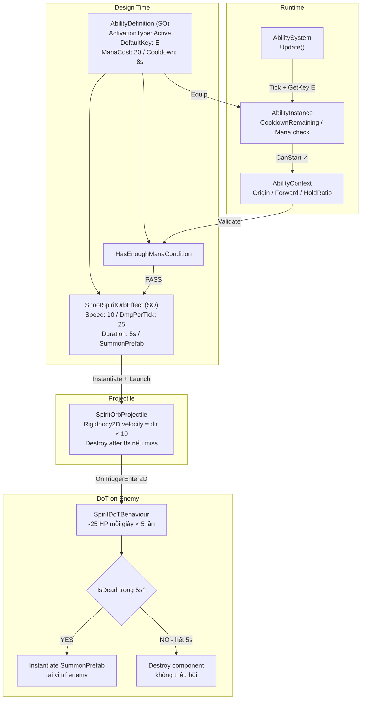
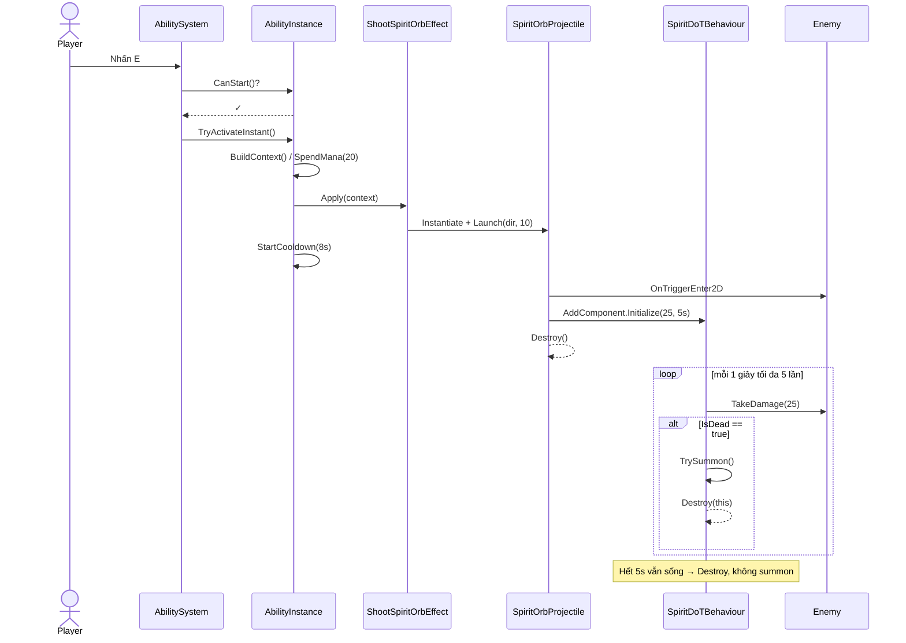
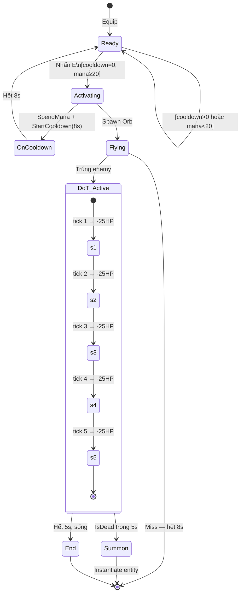

# Ability System — Diagrams

> Source: `Assets/Skill Enhance/Scripts/`
> Branch: `claude/review-skill-architecture-2df7z`
> Date: 2026-05-20

---

## 1. Kiến trúc tổng thể (Architecture Overview)

---

## 2. Luồng kích hoạt Spirit Orb (Sequence Diagram)

---

## 3. Vòng đời Ability (State Diagram)

---

## 4. Class Diagram — Full System (Draw.io Compatible)

```mermaid
classDiagram
    class AbilityDefinition {
        ScriptableObject
        +string Id
        +string DisplayName
        +ActivationType ActivationType
        +KeyCode DefaultKey
        +float Cooldown
        +float ManaCost
        +float MaxHoldTime
    }

    class AbilitySystem {
        MonoBehaviour
        +Equip(slot, definition)
        +Unequip(slot)
        +GetAbility(slot)
        -HandleInput()
    }

    class AbilityInstance {
        +float CooldownRemaining
        +bool IsHolding
        +float CurrentHoldTime
        +Tick(dt)
        +CanStart()
        +TryRelease()
        +TryActivateInstant()
    }

    class AbilityContext {
        +IAbilityOwner Caster
        +Vector3 Origin
        +Vector3 Forward
        +float HoldTime
        +float HoldRatio
    }

    class AbilityConditionDefinition {
        ScriptableObject
        +IsMet(context)
    }

    class AbilityEffectDefinition {
        ScriptableObject
        +Apply(context)
    }

    class IAbilityOwner {
        interface
        +Transform Transform
        +CharacterStats Stats
        +Health Health
        +SimpleCharacterMotor Motor
    }

    class HasEnoughManaCondition {
        ScriptableObject
        +IsMet(context)
    }

    class NotDeadCondition {
        ScriptableObject
        +IsMet(context)
    }

    class ShootSpiritOrbEffect {
        ScriptableObject
        +GameObject OrbPrefab
        +float Speed
        +float DamagePerTick
        +float Duration
        +GameObject SummonPrefab
        +Apply(context)
    }

    class DamageInFrontEffect {
        ScriptableObject
        +float BaseDamage
        +float BonusDamageAtMaxHold
        +float Radius
        +float Angle
        +Apply(context)
    }

    class LungeForwardEffect {
        ScriptableObject
        +float BaseDistance
        +float BonusDistanceAtMaxHold
        +Apply(context)
    }

    class SpiritOrbProjectile {
        MonoBehaviour
        +Launch(dir, speed, lifetime, dmg, dur, summon)
        -OnTriggerEnter2D(other)
    }

    class SpiritDoTBehaviour {
        MonoBehaviour
        +Initialize(dmgPerTick, duration, summonPrefab)
        -DoTRoutine()
        -TrySummon()
    }

    class PlayerAbilityOwner {
        MonoBehaviour
        +CharacterStats Stats
        +Health Health
        +SimpleCharacterMotor Motor
    }

    class SimpleCharacterMotor {
        MonoBehaviour
        +Lunge(direction, distance, duration)
    }

    class Health {
        MonoBehaviour
        +float CurrentHealth
        +bool IsDead
        +TakeDamage(float damage)
    }

    class SimpleDamageReceiver {
        MonoBehaviour
        +ReceiveDamage(float damage)
    }

    class Damageable {
        interface
        +ReceiveDamage(float damage)
    }

    class CharacterStats {
        MonoBehaviour
        +RuntimeStat Attack
        +RuntimeStat MoveSpeed
        +RuntimeStat MaxMana
        +float CurrentMana
        +SpendMana(float)
        +RecoverMana(float)
    }

    class RuntimeStat {
        +float BaseValue
        +float Value
        +AddModifier(modifier)
        +RemoveModifiersBySource(source)
    }

    class StatModifier {
        +StatModifierType Type
        +float Value
        +object Source
    }

    AbilitySystem --> AbilityInstance
    AbilitySystem --> IAbilityOwner
    AbilitySystem --> AbilityDefinition

    AbilityInstance --> AbilityDefinition
    AbilityInstance --> AbilityContext
    AbilityInstance --> IAbilityOwner

    AbilityDefinition --> AbilityConditionDefinition
    AbilityDefinition --> AbilityEffectDefinition

    HasEnoughManaCondition --|> AbilityConditionDefinition
    NotDeadCondition --|> AbilityConditionDefinition

    ShootSpiritOrbEffect --|> AbilityEffectDefinition
    DamageInFrontEffect --|> AbilityEffectDefinition
    LungeForwardEffect --|> AbilityEffectDefinition

    ShootSpiritOrbEffect ..> SpiritOrbProjectile
    SpiritOrbProjectile ..> SpiritDoTBehaviour
    SpiritDoTBehaviour --> Health

    PlayerAbilityOwner ..|> IAbilityOwner
    PlayerAbilityOwner --> CharacterStats
    PlayerAbilityOwner --> Health
    PlayerAbilityOwner --> SimpleCharacterMotor

    SimpleDamageReceiver ..|> Damageable
    SimpleDamageReceiver --> Health

    CharacterStats --> RuntimeStat
    RuntimeStat --> StatModifier
```

