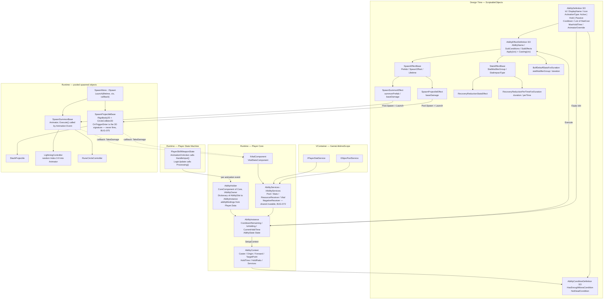
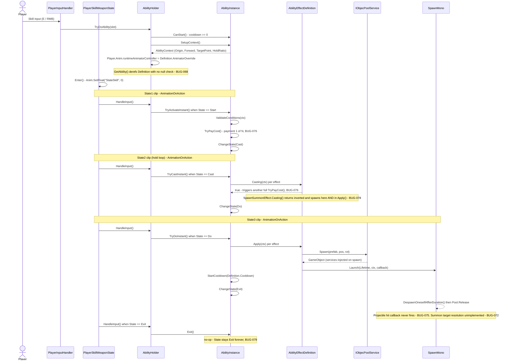
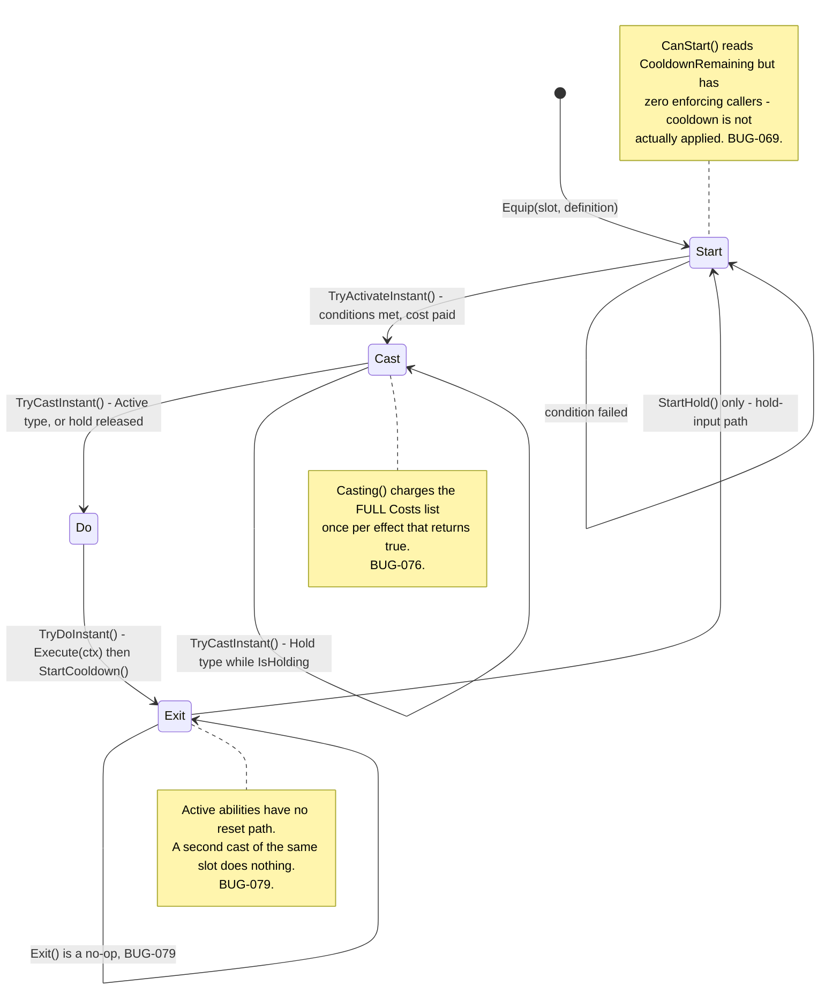

# Ability System — Diagrams

> Source: **`Assets/Script/System/Abilities/`** (originally `Assets/Skill Enhance/Scripts/`;
> parked in `prototypes/skill-enhance-abilities/Scripts/` 2026-08-22; promoted into `Assets/` 2026-09-09)
> Diagrams authored: 2026-05-20 · **§1–§3 rewritten 2026-09-21** against
> `origin/feature/fix-player-control` HEAD `15242e6`

> ⚠️ **REWRITTEN 2026-09-21 — §1–§3 previously described code that no longer exists.**
>
> The 2026-09-11 pass corrected this file's *status* (the framework is live, the player runs it) but
> left the diagrams themselves describing the Spirit Orb prototype. Between `4e4eff5` and `7cceda2`
> the effect and runtime layers were replaced wholesale. Every type named in the old §1–§3 has since
> been deleted:
>
> | Deleted / renamed | Replaced by |
> |---|---|
> | `AbilitySystem` (separate driver) | absorbed into `AbilityHolder : CoreComponent<Core>, IAbilityOwner` |
> | `ShootSpiritOrbEffect` → `ShootObjectEffect` | **deleted** → `SpawnEffectBase` → `SpawnProjectileEffect` / `SpawnSummonEffect` |
> | `DamageInFrontEffect`, `LungeForwardEffect`, `PlayDebugLogEffect` | **deleted** |
> | `SpiritOrbProjectile`, `SpiritDoTBehaviour` | **deleted** → `SpawnMono` → `SpawnProjectileBase` / `SpawnSummonBase` |
> | `AbilityRuntimeHelpers` | **deleted** — hold-ratio math inlined into `AbilityInstance.BuildContext()` |
> | `PlayerAbilityOwner`, `SimpleCharacterMotor`, `Health`, `CharacterStats`, `Damageable` | never existed in this project |
> | `SkillState` enum (`None/Start/Cast/Do/Exit`) | **`AbilityState`** enum (`Start/Cast/Do/Exit`) — no `None` member |
>
> New since the last pass and not previously diagrammed anywhere: `IAbilityServices` /
> `AbilityServices` (the service bundle handed to every `AbilityContext`), `StatsEffectBase`,
> `AbilityEffectDefinition.SubConditions` / `.SubEffects` / `.Casting()`, and the whole
> `Runtime/SpawnMono/` controller layer.
>
> §1–§3 below are drawn from source. **§4 and §5 are retained only as a historical record of the
> prototype's class layout and are NOT accurate** — see the marker on each.
>
> **Two frameworks still coexist, and this document covers the second one:**
>
> | | v1 — `System/Skill_Ability/` | v2 — `System/Abilities/` (below) |
> |---|---|---|
> | Model | Subclass `ActivateSkill` | Compose an `AbilityDefinition` SO |
> | Lifecycle | `Enter → Activate → Cast → Do → Exit` | `AbilityState`: `Start → Cast → Do → Exit` |
> | Used by | `WeaponStats`, `AttackSO`, `Weapon`, `EntityWeapon` | **`AbilityHolder` — the player** |
> | Design doc | `design/gdd/skill-ability-system.md` | **none — this file is the closest thing** |
>
> There is still **no ADR** deciding v1's fate — demo-checklist item 18 in `CLAUDE.md`, BUG-052.
> The original hypothesis and promotion record were in `prototypes/skill-enhance-abilities/README.md`;
> that directory no longer exists on this branch, so the record lives in git history only.

> 🐞 **Open defects these diagrams annotate**: BUG-068, BUG-069, BUG-071, BUG-072, BUG-073,
> BUG-074, BUG-075, BUG-076, BUG-077, BUG-078, BUG-079. Read them before treating any arrow below
> as working behaviour.

---

## 1. Architecture Overview

```mermaid
flowchart TD
    subgraph DESIGN["Design Time — ScriptableObjects"]
        DEF["AbilityDefinition SO
Id / DisplayName / Icon
ActivationType: Active | Hold | Passive
Cooldown / List of StatCost
MaxHoldTime / AnimatorOverride"]
        COND["AbilityConditionDefinition SO
HasEnoughManaCondition
NotDeadCondition"]
        EFF["AbilityEffectDefinition SO
AbilityName / SubConditions / SubEffects
Apply(ctx) + Casting(ctx)"]
        SPAWN["SpawnEffectBase
Prefab / SpawnOffset / Lifetime"]
        STATS["StatsEffectBase
StatModifierGroup / StatImpactType"]
        SPROJ["SpawnProjectileEffect
baseDamage"]
        SSUM["SpawnSummonEffect
summonPrefab / baseDamage"]
        RRS["RecoveryReductionStatsEffect"]
        RRPT["RecoveryReductionPerTimeForDuration
duration / perTime"]
        BUFF["BuffDebuffStatsForDuration
statModifierGroup / duration"]
        DEF --> COND
        DEF --> EFF
        EFF --> SPAWN
        EFF --> STATS
        EFF --> BUFF
        SPAWN --> SPROJ
        SPAWN --> SSUM
        STATS --> RRS
        STATS --> RRPT
    end

    subgraph DI["VContainer — GameLifetimeScope"]
        POOL["IObjecPoolService"]
        PSTAT["IPlayerStatService"]
    end

    subgraph CORE["Runtime — Player Core"]
        HOLDER["AbilityHolder
CoreComponent of Core, IAbilityOwner
Dictionary of AbilitySlot to AbilityInstance
abilityBindings from Player.Data"]
        SVC["AbilityServices : IAbilityServices
Pool / Stats / ResourceReceiver / Vital
NegativeReceiver — shared mutable, BUG-072"]
        INST["AbilityInstance
CooldownRemaining / IsHolding / CurrentHoldTime
AbilityState State"]
        CTX["AbilityContext
Caster / Origin / Forward / TargetPoint
HoldTime / HoldRatio / Services"]
        VITAL["IVitalComponent
VitalStatsComponent"]
    end

    subgraph STATE["Runtime — Player State Machine"]
        PSWS["PlayerSkillWeaponState
AnimationOnAction calls HandleInput()
LogicUpdate calls Processing()"]
    end

    subgraph WORLD["Runtime — pooled spawned objects"]
        MONO["SpawnMono : ISpawn
Launch(lifetime, ctx, callback)"]
        PROJ["SpawnProjectileBase
Rigidbody2D + CircleCollider2D
OnTriggerEnter is the 3D signature — never fires, BUG-075"]
        SUM["SpawnSummonBase
Animator; Execute() called by Animation Event"]
        SLASH["SlashProjectile"]
        LIGHT["LightningController
random Index 0-9 into Animator"]
        RUNE["RuneCircleController"]
        MONO --> PROJ
        MONO --> SUM
        PROJ --> SLASH
        SUM --> LIGHT
        SUM --> RUNE
    end

    DEF -->|Equip slot| INST
    POOL --> SVC
    PSTAT --> SVC
    VITAL --> SVC
    SVC --> INST
    HOLDER --> INST
    PSWS -->|per animation event| HOLDER
    INST -->|SetupContext| CTX
    CTX --> COND
    INST -->|Execute| EFF
    SPROJ -->|Pool.Spawn + Launch| PROJ
    SSUM -->|Pool.Spawn + Launch| SUM
    PROJ -.->|callback: TakeDamage| VITAL
    SUM -.->|callback: TakeDamage| VITAL
```

**Wiring notes not visible in the graph**

- `AbilityHolder.Construct(IObjecPoolService)` is the only `[Inject]` point; `IPlayerStatService`,
  `IResourceReceiver` and `IVitalComponent` are pulled with `Core.GetComponentInChildren<T>()` in
  `Setup()`, not through the container.
- `AbilityHolder` is registered in `GameLifetimeScope.Configure()` with
  `RegisterComponentInHierarchy<AbilityHolder>()`, so it must exist in the scene at `Awake()`.
- `abilityBindings` is read from `core.Player.Data.AbilityBindings` in `Start()` — the serialized list
  on the component is overwritten, so editing it on the prefab has no effect.
- Pooled spawn objects are injected by `Pool.Spawn()`, never registered in the container.

---

## 2. Activation Flow (Sequence Diagram)

> Drawn for `AbilityActivationType.Active` — the Paladin Consecrate path.
> Each numbered block is one Unity Animation Event on a clip supplied by
> `AbilityDefinition.AnimatorOverride`.

```mermaid
sequenceDiagram
    actor P as Player
    participant PIH as PlayerInputHandler
    participant SM as PlayerSkillWeaponState
    participant AH as AbilityHolder
    participant AI as AbilityInstance
    participant EFF as AbilityEffectDefinition
    participant POOL as IObjecPoolService
    participant OBJ as SpawnMono

    P->>PIH: Skill input (E / RMB)
    PIH->>AH: TryDoAbility(slot)
    AH->>AI: CanStart() - cooldown == 0
    AH->>AI: SetupContext()
    AI-->>AH: AbilityContext (Origin, Forward, TargetPoint, HoldRatio)
    AH->>AH: Player.Anim.runtimeAnimatorController = Definition.AnimatorOverride
    Note over AH: GetAbility() derefs Definition with no null check - BUG-068

    SM->>SM: Enter() - Anim.SetFloat("StateSkill", 0)

    Note over SM,AI: State1 clip - AnimationOnAction
    SM->>AH: HandleInput()
    AH->>AI: TryActivateInstant() when State == Start
    AI->>AI: ValidateConditions(ctx)
    AI->>AI: TryPayCost() - payment 1 of N, BUG-076
    AI->>AI: ChangeState(Cast)

    Note over SM,AI: State2 clip (hold loop) - AnimationOnAction
    SM->>AH: HandleInput()
    AH->>AI: TryCastInstant() when State == Cast
    AI->>EFF: Casting(ctx) per effect
    EFF-->>AI: true - triggers another full TryPayCost(), BUG-076
    Note over EFF: SpawnSummonEffect.Casting() returns inverted and spawns here AND in Apply() - BUG-078
    AI->>AI: ChangeState(Do)

    Note over SM,OBJ: State3 clip - AnimationOnAction
    SM->>AH: HandleInput()
    AH->>AI: TryDoInstant() when State == Do
    AI->>EFF: Apply(ctx) per effect
    EFF->>POOL: Spawn(prefab, pos, rot)
    POOL-->>EFF: GameObject (services injected on spawn)
    EFF->>OBJ: Launch(Lifetime, ctx, callback)
    AI->>AI: StartCooldown(Definition.Cooldown)
    AI->>AI: ChangeState(Exit)

    OBJ-->>OBJ: DespawnOneselfAffterDuration() then Pool.Release
    Note over OBJ: Projectile hit callback never fires - BUG-075. Summon target resolution unimplemented - BUG-072

    SM->>AH: HandleInput() when State == Exit
    AH->>AI: Exit()
    Note over AI: no-op - State stays Exit forever, BUG-079
```

---

## 3. Ability Lifecycle (State Diagram)

> `AbilityState` is declared in `AbilityDefinition.cs:74-80`. There is **no** `None` member —
> `AbilityInstance.State` is initialised to `Start`.

```mermaid
stateDiagram-v2
    [*] --> Start: Equip(slot, definition)

    Start --> Cast: TryActivateInstant() - conditions met, cost paid
    Start --> Start: condition failed

    Cast --> Do: TryCastInstant() - Active type, or hold released
    Cast --> Cast: TryCastInstant() - Hold type while IsHolding

    Do --> Exit: TryDoInstant() - Execute(ctx) then StartCooldown()

    Exit --> Exit: Exit() is a no-op, BUG-079
    Exit --> Start: StartHold() only - hold-input path

    note right of Cast
        Casting() charges the FULL Costs list
        once per effect that returns true.
        BUG-076.
    end note

    note right of Exit
        Active abilities have no reset path.
        A second cast of the same slot does nothing.
        BUG-079.
    end note

    note left of Start
        CanStart() reads CooldownRemaining but has
        zero enforcing callers - cooldown is not
        actually applied. BUG-069.
    end note
```

---

> 🕰️ **HISTORICAL — §4 and §5 below describe the deleted prototype class layout (2026-05-20).**
> They are kept as a record of the design that was promoted, not as documentation of current code.
> Do not use them to name a type. See the deletion table at the top of this file.

## 4. Class Diagram — Full System (Draw.io Compatible)

```mermaid
classDiagram
    class AbilityDefinition {
        ScriptableObject
        +string Id
        +string DisplayName
        +ActivationType ActivationType
        +KeyCode DefaultKey
        +float Cooldown
        +float ManaCost
        +float MaxHoldTime
    }

    class AbilitySystem {
        MonoBehaviour
        +Equip(slot, definition)
        +Unequip(slot)
        +GetAbility(slot)
        -HandleInput()
    }

    class AbilityInstance {
        +float CooldownRemaining
        +bool IsHolding
        +float CurrentHoldTime
        +Tick(dt)
        +CanStart()
        +TryRelease()
        +TryActivateInstant()
    }

    class AbilityContext {
        +IAbilityOwner Caster
        +Vector3 Origin
        +Vector3 Forward
        +float HoldTime
        +float HoldRatio
    }

    class AbilityConditionDefinition {
        ScriptableObject
        +IsMet(context)
    }

    class AbilityEffectDefinition {
        ScriptableObject
        +Apply(context)
    }

    class IAbilityOwner {
        interface
        +Transform Transform
        +CharacterStats Stats
        +Health Health
        +SimpleCharacterMotor Motor
    }

    class HasEnoughManaCondition {
        ScriptableObject
        +IsMet(context)
    }

    class NotDeadCondition {
        ScriptableObject
        +IsMet(context)
    }

    class ShootSpiritOrbEffect {
        ScriptableObject
        +GameObject OrbPrefab
        +float Speed
        +float DamagePerTick
        +float Duration
        +GameObject SummonPrefab
        +Apply(context)
    }

    class DamageInFrontEffect {
        ScriptableObject
        +float BaseDamage
        +float BonusDamageAtMaxHold
        +float Radius
        +float Angle
        +Apply(context)
    }

    class LungeForwardEffect {
        ScriptableObject
        +float BaseDistance
        +float BonusDistanceAtMaxHold
        +Apply(context)
    }

    class SpiritOrbProjectile {
        MonoBehaviour
        +Launch(dir, speed, lifetime, dmg, dur, summon)
        -OnTriggerEnter2D(other)
    }

    class SpiritDoTBehaviour {
        MonoBehaviour
        +Initialize(dmgPerTick, duration, summonPrefab)
        -DoTRoutine()
        -TrySummon()
    }

    class PlayerAbilityOwner {
        MonoBehaviour
        +CharacterStats Stats
        +Health Health
        +SimpleCharacterMotor Motor
    }

    class SimpleCharacterMotor {
        MonoBehaviour
        +Lunge(direction, distance, duration)
    }

    class Health {
        MonoBehaviour
        +float CurrentHealth
        +bool IsDead
        +TakeDamage(float damage)
    }

    class SimpleDamageReceiver {
        MonoBehaviour
        +ReceiveDamage(float damage)
    }

    class Damageable {
        interface
        +ReceiveDamage(float damage)
    }

    class CharacterStats {
        MonoBehaviour
        +RuntimeStat Attack
        +RuntimeStat MoveSpeed
        +RuntimeStat Mana
        +float CurrentMana
        +SpendMana(float)
        +RecoverMana(float)
    }

    class RuntimeStat {
        +float BaseValue
        +float Value
        +AddModifier(modifier)
        +RemoveModifiersBySource(source)
    }

    class StatModifier {
        +StatModifierType Type
        +float Value
        +object Source
    }

    AbilitySystem --> AbilityInstance
    AbilitySystem --> IAbilityOwner
    AbilitySystem --> AbilityDefinition

    AbilityInstance --> AbilityDefinition
    AbilityInstance --> AbilityContext
    AbilityInstance --> IAbilityOwner

    AbilityDefinition --> AbilityConditionDefinition
    AbilityDefinition --> AbilityEffectDefinition

    HasEnoughManaCondition --|> AbilityConditionDefinition
    NotDeadCondition --|> AbilityConditionDefinition

    ShootSpiritOrbEffect --|> AbilityEffectDefinition
    DamageInFrontEffect --|> AbilityEffectDefinition
    LungeForwardEffect --|> AbilityEffectDefinition

    ShootSpiritOrbEffect ..> SpiritOrbProjectile
    SpiritOrbProjectile ..> SpiritDoTBehaviour
    SpiritDoTBehaviour --> Health

    PlayerAbilityOwner ..|> IAbilityOwner
    PlayerAbilityOwner --> CharacterStats
    PlayerAbilityOwner --> Health
    PlayerAbilityOwner --> SimpleCharacterMotor

    SimpleDamageReceiver ..|> Damageable
    SimpleDamageReceiver --> Health

    CharacterStats --> RuntimeStat
    RuntimeStat --> StatModifier
```

---

## 5. Class Diagram — Full Stereotypes (Standard Mermaid)

> Full version with `<<interface>>`, `<<ScriptableObject>>`, `<<MonoBehaviour>>` stereotypes — renders in GitHub, Notion and VS Code

```mermaid
classDiagram
    class AbilityDefinition {
        <<ScriptableObject>>
        +string Id
        +string DisplayName
        +AbilityActivationType ActivationType
        +KeyCode DefaultKey
        +float Cooldown
        +float ManaCost
        +float MaxHoldTime
        +List~AbilityConditionDefinition~ Conditions
        +List~AbilityEffectDefinition~ Effects
    }

    class AbilitySystem {
        <<MonoBehaviour>>
        +Equip(slot, definition)
        +Unequip(slot)
        +GetAbility(slot) AbilityInstance
        -HandleInput()
    }

    class AbilityInstance {
        +float CooldownRemaining
        +bool IsHolding
        +float CurrentHoldTime
        +Tick(dt)
        +CanStart() bool
        +StartHold()
        +CancelHold()
        +TryRelease() bool
        +TryActivateInstant() bool
    }

    class AbilityContext {
        +IAbilityOwner Caster
        +Vector3 Origin
        +Vector3 Forward
        +Vector3 TargetPoint
        +float HoldTime
        +float HoldRatio
        +AbilityInstance AbilityInstance
        +AbilityDefinition AbilityDefinition
    }

    class AbilityConditionDefinition {
        <<ScriptableObject>>
        +IsMet(context) bool
    }

    class AbilityEffectDefinition {
        <<ScriptableObject>>
        +Apply(context)
    }

    class IAbilityOwner {
        <<interface>>
        +Transform Transform
        +CharacterStats Stats
        +Health Health
        +SimpleCharacterMotor Motor
    }

    class HasEnoughManaCondition {
        <<ScriptableObject>>
        +IsMet(context) bool
    }

    class NotDeadCondition {
        <<ScriptableObject>>
        +IsMet(context) bool
    }

    class ShootSpiritOrbEffect {
        <<ScriptableObject>>
        +GameObject OrbPrefab
        +float Speed
        +float SpawnOffset
        +float OrbLifetime
        +float DamagePerTick
        +float Duration
        +GameObject SummonPrefab
        +Apply(context)
    }

    class DamageInFrontEffect {
        <<ScriptableObject>>
        +float BaseDamage
        +float BonusDamageAtMaxHold
        +float Radius
        +float Angle
        +LayerMask TargetMask
        +Apply(context)
    }

    class LungeForwardEffect {
        <<ScriptableObject>>
        +float BaseDistance
        +float BonusDistanceAtMaxHold
        +float BaseDuration
        +float MinDurationAtMaxHold
        +Apply(context)
    }

    class SpiritOrbProjectile {
        <<MonoBehaviour>>
        +Launch(dir, speed, lifetime, dmg, dur, summon)
        -OnTriggerEnter2D(other)
    }

    class SpiritDoTBehaviour {
        <<MonoBehaviour>>
        +Initialize(dmgPerTick, duration, summonPrefab)
        -DoTRoutine() IEnumerator
        -TrySummon()
    }

    class PlayerAbilityOwner {
        <<MonoBehaviour>>
        +CharacterStats Stats
        +Health Health
        +SimpleCharacterMotor Motor
    }

    class SimpleCharacterMotor {
        <<MonoBehaviour>>
        +Lunge(direction, distance, duration)
    }

    class Health {
        <<MonoBehaviour>>
        +float CurrentHealth
        +bool IsDead
        +TakeDamage(float damage)
    }

    class SimpleDamageReceiver {
        <<MonoBehaviour>>
        +ReceiveDamage(float damage)
    }

    class Damageable {
        <<interface>>
        +ReceiveDamage(float damage)
    }

    class CharacterStats {
        <<MonoBehaviour>>
        +RuntimeStat Attack
        +RuntimeStat MoveSpeed
        +RuntimeStat Mana
        +float CurrentMana
        +GetStatValue(type) float
        +SpendMana(float)
        +RecoverMana(float)
    }

    class RuntimeStat {
        +float BaseValue
        +float Value
        +AddModifier(modifier)
        +RemoveModifiersBySource(source)
    }

    class StatModifier {
        +StatModifierType Type
        +float Value
        +object Source
    }

    class AbilityActivationType {
        <<enumeration>>
        Active
        Hold
        Passive
    }

    class StatModifierType {
        <<enumeration>>
        Flat
        Percent
    }

    class StatType {
        <<enumeration>>
        Attack
        MoveSpeed
        MaxHealth
        Mana
    }

    AbilityDefinition --> AbilityActivationType
    AbilityDefinition "1" o-- "many" AbilityConditionDefinition
    AbilityDefinition "1" o-- "many" AbilityEffectDefinition

    AbilitySystem --> AbilityInstance
    AbilitySystem --> IAbilityOwner
    AbilitySystem --> AbilityDefinition

    AbilityInstance --> AbilityDefinition
    AbilityInstance --> AbilityContext
    AbilityInstance --> IAbilityOwner

    HasEnoughManaCondition --|> AbilityConditionDefinition
    NotDeadCondition --|> AbilityConditionDefinition

    ShootSpiritOrbEffect --|> AbilityEffectDefinition
    DamageInFrontEffect --|> AbilityEffectDefinition
    LungeForwardEffect --|> AbilityEffectDefinition

    ShootSpiritOrbEffect ..> SpiritOrbProjectile : Instantiate
    SpiritOrbProjectile ..> SpiritDoTBehaviour : AddComponent
    SpiritDoTBehaviour --> Health

    PlayerAbilityOwner ..|> IAbilityOwner
    PlayerAbilityOwner --> CharacterStats
    PlayerAbilityOwner --> Health
    PlayerAbilityOwner --> SimpleCharacterMotor

    SimpleDamageReceiver ..|> Damageable
    SimpleDamageReceiver --> Health

    CharacterStats --> RuntimeStat
    CharacterStats --> StatType
    RuntimeStat "1" *-- "many" StatModifier
    StatModifier --> StatModifierType
```

