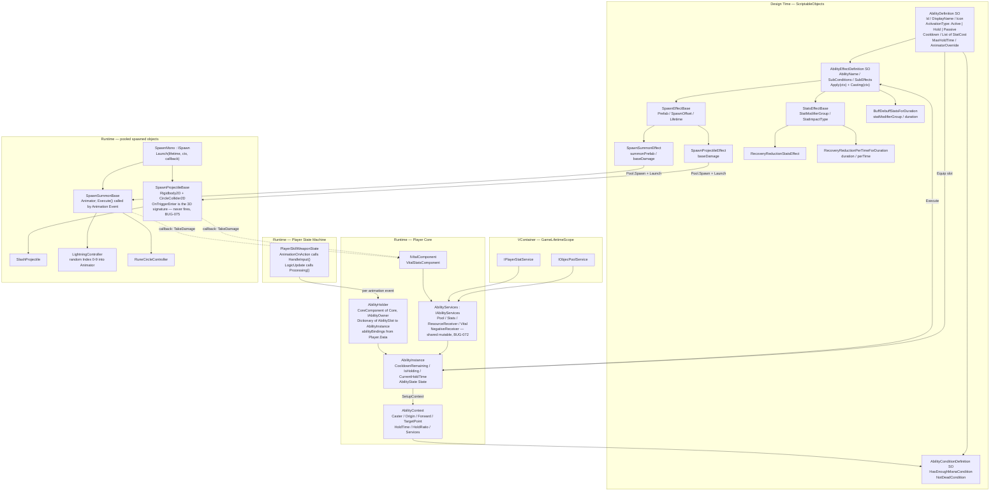
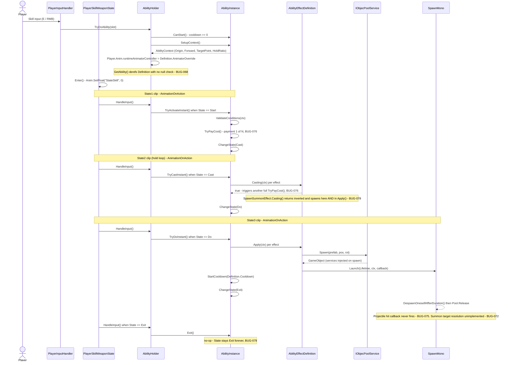
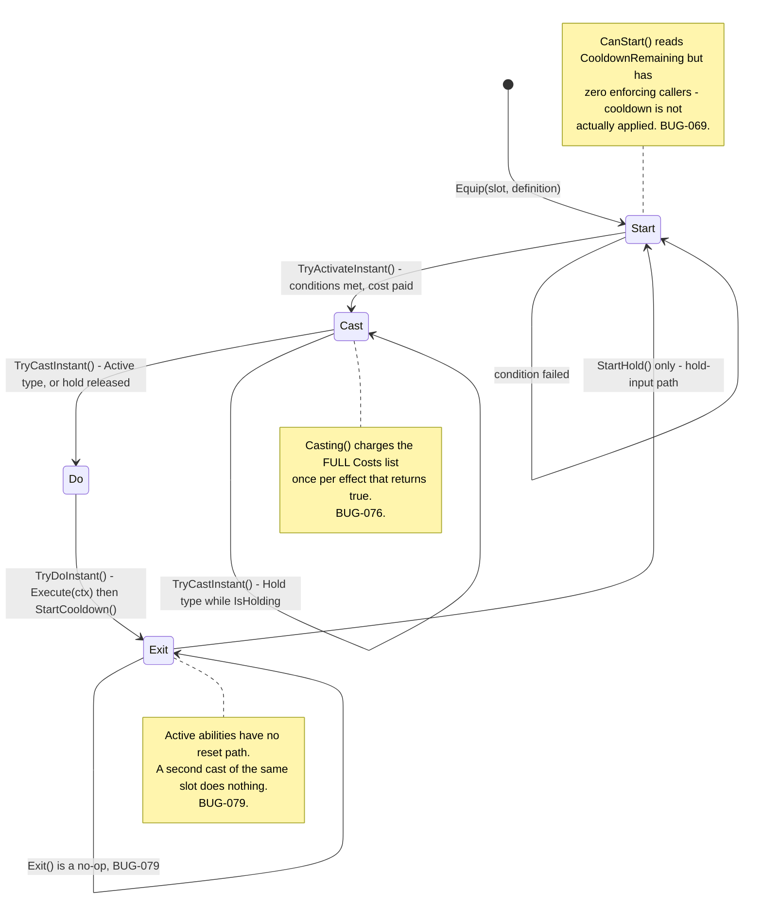
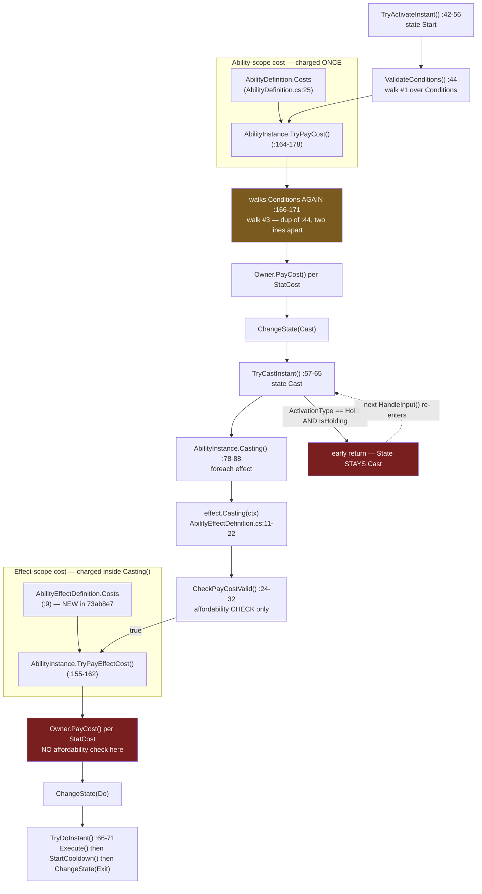
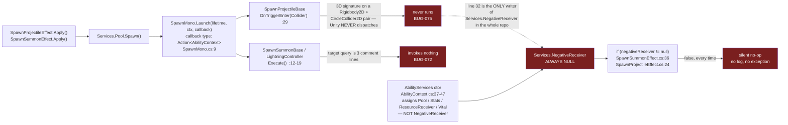
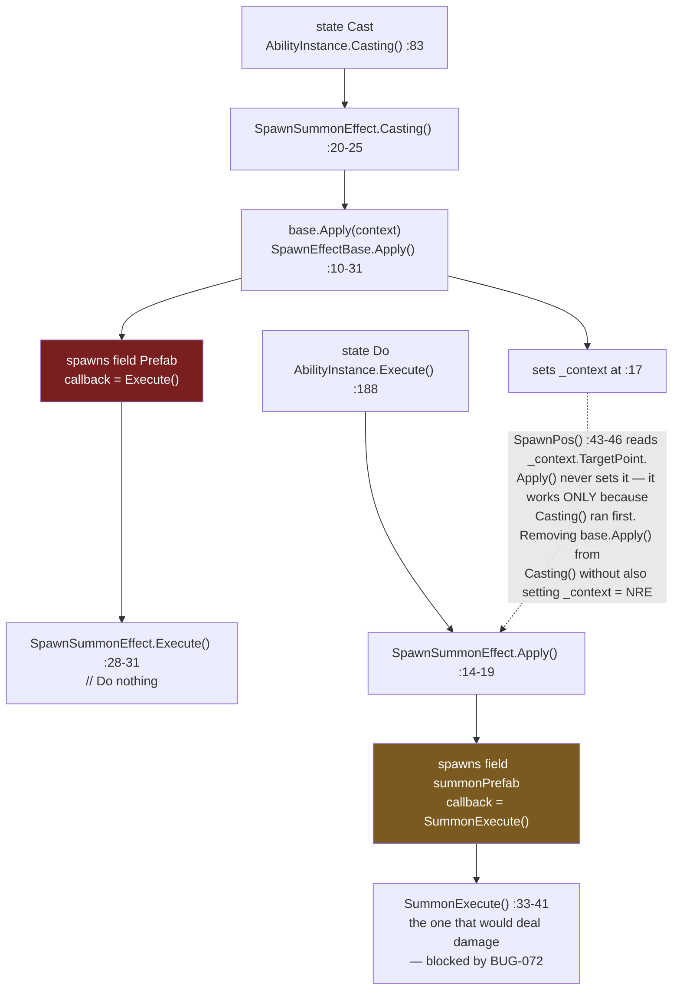
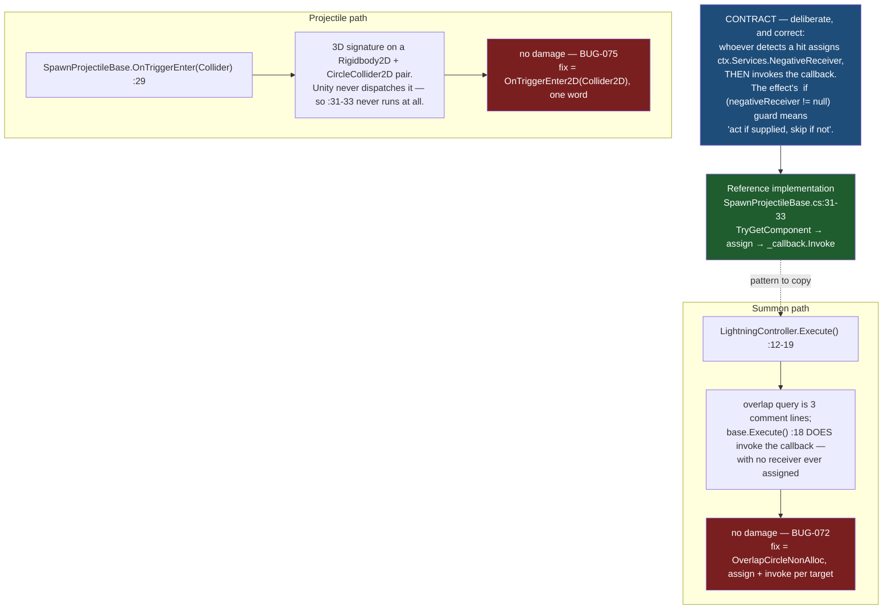
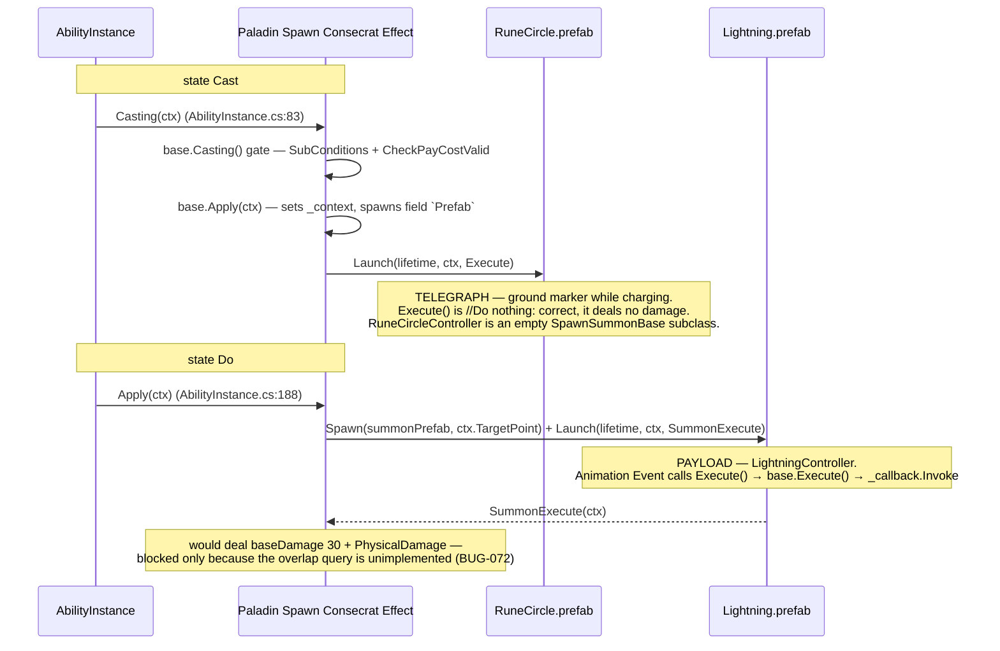
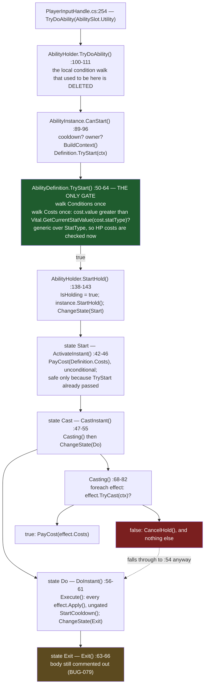

# Ability System — Diagrams

> Source: **`Assets/Script/System/Abilities/`** (originally `Assets/Skill Enhance/Scripts/`;
> parked in `prototypes/skill-enhance-abilities/Scripts/` 2026-08-22; promoted into `Assets/` 2026-09-09)
> Diagrams authored: 2026-05-20 · **§1–§3 rewritten 2026-09-21** against
> `origin/feature/fix-player-control` HEAD `15242e6`

> ⚠️ **REWRITTEN 2026-09-21 — §1–§3 previously described code that no longer exists.**
>
> The 2026-09-11 pass corrected this file's *status* (the framework is live, the player runs it) but
> left the diagrams themselves describing the Spirit Orb prototype. Between `4e4eff5` and `7cceda2`
> the effect and runtime layers were replaced wholesale. Every type named in the old §1–§3 has since
> been deleted:
>
> | Deleted / renamed | Replaced by |
> |---|---|
> | `AbilitySystem` (separate driver) | absorbed into `AbilityHolder : CoreComponent<Core>, IAbilityOwner` |
> | `ShootSpiritOrbEffect` → `ShootObjectEffect` | **deleted** → `SpawnEffectBase` → `SpawnProjectileEffect` / `SpawnSummonEffect` |
> | `DamageInFrontEffect`, `LungeForwardEffect`, `PlayDebugLogEffect` | **deleted** |
> | `SpiritOrbProjectile`, `SpiritDoTBehaviour` | **deleted** → `SpawnMono` → `SpawnProjectileBase` / `SpawnSummonBase` |
> | `AbilityRuntimeHelpers` | **deleted** — hold-ratio math inlined into `AbilityInstance.BuildContext()` |
> | `PlayerAbilityOwner`, `SimpleCharacterMotor`, `Health`, `CharacterStats`, `Damageable` | never existed in this project |
> | `SkillState` enum (`None/Start/Cast/Do/Exit`) | **`AbilityState`** enum (`Start/Cast/Do/Exit`) — no `None` member |
>
> New since the last pass and not previously diagrammed anywhere: `IAbilityServices` /
> `AbilityServices` (the service bundle handed to every `AbilityContext`), `StatsEffectBase`,
> `AbilityEffectDefinition.SubConditions` / `.SubEffects` / `.Casting()`, and the whole
> `Runtime/SpawnMono/` controller layer.
>
> §1–§3 below are drawn from source. **§4 and §5 are retained only as a historical record of the
> prototype's class layout and are NOT accurate** — see the marker on each.
>
> **Two frameworks still coexist, and this document covers the second one:**
>
> | | v1 — `System/Skill_Ability/` | v2 — `System/Abilities/` (below) |
> |---|---|---|
> | Model | Subclass `ActivateSkill` | Compose an `AbilityDefinition` SO |
> | Lifecycle | `Enter → Activate → Cast → Do → Exit` | `AbilityState`: `Start → Cast → Do → Exit` |
> | Used by | `WeaponStats`, `AttackSO`, `Weapon`, `EntityWeapon` | **`AbilityHolder` — the player** |
> | Design doc | `design/gdd/skill-ability-system.md` | **none — this file is the closest thing** |
>
> There is still **no ADR** deciding v1's fate — demo-checklist item 18 in `CLAUDE.md`, BUG-052.
> The original hypothesis and promotion record were in `prototypes/skill-enhance-abilities/README.md`;
> that directory no longer exists on this branch, so the record lives in git history only.

> 🐞 **Open defects these diagrams annotate**: BUG-068, BUG-069, BUG-071, BUG-072, BUG-073,
> BUG-074, BUG-075, BUG-076, BUG-077, BUG-078, BUG-079. Read them before treating any arrow below
> as working behaviour.

---

> ### ➕ ADDED 2026-09-22 — read §6 and §7 for the current version
>
> **Nothing above this line was edited.** §1–§5 are left exactly as written on 2026-09-21 at HEAD
> `15242e6`, so the drift stays auditable. Two commits landed afterwards — `73ab8e7` ("coding update
> flow ability, update logic cost") and `e2cb75e` ("done"), reaching `main` via `d17fcc5` — and they
> changed the cost model and part of the spawn path.
>
> - **§6 — Current Version (HEAD `d17fcc5`)**: a table of the five §1–§3 annotations that are now
>   stale, plus three new diagrams drawn from source — the two-list cost model, the damage dead end,
>   and the `SpawnSummonEffect` double spawn.
> - **§7 — System assessment**: strengths and weaknesses of the architecture as it ships, with a
>   recommended fix order.
> - **§8 — Owner review of §6 and §7 (same day)**: three findings in §6/§7 were put to the owner;
>   two were wrong and one was misattributed. §6 and §7 are left unedited and §8 carries the
>   corrections, so both the claim and its rebuttal stay on the record. **Read §8 before acting on
>   anything in §6 or §7.**
> - **§9 — Post-fetch re-verification (same day, HEAD `2a83469`)**: two commits landed after §8 was
>   written. They fixed BUG-076, BUG-077 and BUG-085, renamed `Casting()` to `TryCast()`, and broke
>   the build (BUG-088). **§9 supersedes §6, §7 and §8 wherever they disagree — read it first.**
>
> Headline change since §1–§3 were written: **BUG-069 is FIXED** (cooldown is enforced), **BUG-078's
> inverted return is FIXED**, **BUG-076 is re-scoped** (the double-charge is gone; three different
> cost defects replace it), and **BUG-079's "castable once per scene load" claim was wrong** —
> abilities do re-cast. Working the other way: **BUG-072 is confirmed and far wider than recorded**
> — `Services.NegativeReceiver` is permanently null, so **no v2 effect deals any damage at all**.
> Defects filed since: BUG-080…BUG-087.
>
> ⚠️ **Superseded the same day by §8:** the “architectural flaw” framing of BUG-072 is
> **withdrawn** — set-then-invoke is the intended, correct contract, and only two hooks are
> unimplemented. **BUG-078 is CLOSED**: the two-object spawn is Consecrate's intended
> telegraph-then-strike, verified against the asset. BUG-076 was re-scoped again — (a) and (b)
> resolved, (b′) and (c) open.

---

## 1. Architecture Overview


```mermaid
flowchart TD
    subgraph DESIGN["Design Time — ScriptableObjects"]
        DEF["AbilityDefinition SO
Id / DisplayName / Icon
ActivationType: Active | Hold | Passive
Cooldown / List of StatCost
MaxHoldTime / AnimatorOverride"]
        COND["AbilityConditionDefinition SO
HasEnoughManaCondition
NotDeadCondition"]
        EFF["AbilityEffectDefinition SO
AbilityName / SubConditions / SubEffects
Apply(ctx) + Casting(ctx)"]
        SPAWN["SpawnEffectBase
Prefab / SpawnOffset / Lifetime"]
        STATS["StatsEffectBase
StatModifierGroup / StatImpactType"]
        SPROJ["SpawnProjectileEffect
baseDamage"]
        SSUM["SpawnSummonEffect
summonPrefab / baseDamage"]
        RRS["RecoveryReductionStatsEffect"]
        RRPT["RecoveryReductionPerTimeForDuration
duration / perTime"]
        BUFF["BuffDebuffStatsForDuration
statModifierGroup / duration"]
        DEF --> COND
        DEF --> EFF
        EFF --> SPAWN
        EFF --> STATS
        EFF --> BUFF
        SPAWN --> SPROJ
        SPAWN --> SSUM
        STATS --> RRS
        STATS --> RRPT
    end

    subgraph DI["VContainer — GameLifetimeScope"]
        POOL["IObjecPoolService"]
        PSTAT["IPlayerStatService"]
    end

    subgraph CORE["Runtime — Player Core"]
        HOLDER["AbilityHolder
CoreComponent of Core, IAbilityOwner
Dictionary of AbilitySlot to AbilityInstance
abilityBindings from Player.Data"]
        SVC["AbilityServices : IAbilityServices
Pool / Stats / ResourceReceiver / Vital
NegativeReceiver — shared mutable, BUG-072"]
        INST["AbilityInstance
CooldownRemaining / IsHolding / CurrentHoldTime
AbilityState State"]
        CTX["AbilityContext
Caster / Origin / Forward / TargetPoint
HoldTime / HoldRatio / Services"]
        VITAL["IVitalComponent
VitalStatsComponent"]
    end

    subgraph STATE["Runtime — Player State Machine"]
        PSWS["PlayerSkillWeaponState
AnimationOnAction calls HandleInput()
LogicUpdate calls Processing()"]
    end

    subgraph WORLD["Runtime — pooled spawned objects"]
        MONO["SpawnMono : ISpawn
Launch(lifetime, ctx, callback)"]
        PROJ["SpawnProjectileBase
Rigidbody2D + CircleCollider2D
OnTriggerEnter is the 3D signature — never fires, BUG-075"]
        SUM["SpawnSummonBase
Animator; Execute() called by Animation Event"]
        SLASH["SlashProjectile"]
        LIGHT["LightningController
random Index 0-9 into Animator"]
        RUNE["RuneCircleController"]
        MONO --> PROJ
        MONO --> SUM
        PROJ --> SLASH
        SUM --> LIGHT
        SUM --> RUNE
    end

    DEF -->|Equip slot| INST
    POOL --> SVC
    PSTAT --> SVC
    VITAL --> SVC
    SVC --> INST
    HOLDER --> INST
    PSWS -->|per animation event| HOLDER
    INST -->|SetupContext| CTX
    CTX --> COND
    INST -->|Execute| EFF
    SPROJ -->|Pool.Spawn + Launch| PROJ
    SSUM -->|Pool.Spawn + Launch| SUM
    PROJ -.->|callback: TakeDamage| VITAL
    SUM -.->|callback: TakeDamage| VITAL
```

**Wiring notes not visible in the graph**

- `AbilityHolder.Construct(IObjecPoolService)` is the only `[Inject]` point; `IPlayerStatService`,
  `IResourceReceiver` and `IVitalComponent` are pulled with `Core.GetComponentInChildren<T>()` in
  `Setup()`, not through the container.
- `AbilityHolder` is registered in `GameLifetimeScope.Configure()` with
  `RegisterComponentInHierarchy<AbilityHolder>()`, so it must exist in the scene at `Awake()`.
- `abilityBindings` is read from `core.Player.Data.AbilityBindings` in `Start()` — the serialized list
  on the component is overwritten, so editing it on the prefab has no effect.
- Pooled spawn objects are injected by `Pool.Spawn()`, never registered in the container.

---

## 2. Activation Flow (Sequence Diagram)

> Drawn for `AbilityActivationType.Active` — the Paladin Consecrate path.
> Each numbered block is one Unity Animation Event on a clip supplied by
> `AbilityDefinition.AnimatorOverride`.


```mermaid
sequenceDiagram
    actor P as Player
    participant PIH as PlayerInputHandler
    participant SM as PlayerSkillWeaponState
    participant AH as AbilityHolder
    participant AI as AbilityInstance
    participant EFF as AbilityEffectDefinition
    participant POOL as IObjecPoolService
    participant OBJ as SpawnMono

    P->>PIH: Skill input (E / RMB)
    PIH->>AH: TryDoAbility(slot)
    AH->>AI: CanStart() - cooldown == 0
    AH->>AI: SetupContext()
    AI-->>AH: AbilityContext (Origin, Forward, TargetPoint, HoldRatio)
    AH->>AH: Player.Anim.runtimeAnimatorController = Definition.AnimatorOverride
    Note over AH: GetAbility() derefs Definition with no null check - BUG-068

    SM->>SM: Enter() - Anim.SetFloat("StateSkill", 0)

    Note over SM,AI: State1 clip - AnimationOnAction
    SM->>AH: HandleInput()
    AH->>AI: TryActivateInstant() when State == Start
    AI->>AI: ValidateConditions(ctx)
    AI->>AI: TryPayCost() - payment 1 of N, BUG-076
    AI->>AI: ChangeState(Cast)

    Note over SM,AI: State2 clip (hold loop) - AnimationOnAction
    SM->>AH: HandleInput()
    AH->>AI: TryCastInstant() when State == Cast
    AI->>EFF: Casting(ctx) per effect
    EFF-->>AI: true - triggers another full TryPayCost(), BUG-076
    Note over EFF: SpawnSummonEffect.Casting() returns inverted and spawns here AND in Apply() - BUG-078
    AI->>AI: ChangeState(Do)

    Note over SM,OBJ: State3 clip - AnimationOnAction
    SM->>AH: HandleInput()
    AH->>AI: TryDoInstant() when State == Do
    AI->>EFF: Apply(ctx) per effect
    EFF->>POOL: Spawn(prefab, pos, rot)
    POOL-->>EFF: GameObject (services injected on spawn)
    EFF->>OBJ: Launch(Lifetime, ctx, callback)
    AI->>AI: StartCooldown(Definition.Cooldown)
    AI->>AI: ChangeState(Exit)

    OBJ-->>OBJ: DespawnOneselfAffterDuration() then Pool.Release
    Note over OBJ: Projectile hit callback never fires - BUG-075. Summon target resolution unimplemented - BUG-072

    SM->>AH: HandleInput() when State == Exit
    AH->>AI: Exit()
    Note over AI: no-op - State stays Exit forever, BUG-079
```

---

## 3. Ability Lifecycle (State Diagram)

> `AbilityState` is declared in `AbilityDefinition.cs:74-80`. There is **no** `None` member —
> `AbilityInstance.State` is initialised to `Start`.


```mermaid
stateDiagram-v2
    [*] --> Start: Equip(slot, definition)

    Start --> Cast: TryActivateInstant() - conditions met, cost paid
    Start --> Start: condition failed

    Cast --> Do: TryCastInstant() - Active type, or hold released
    Cast --> Cast: TryCastInstant() - Hold type while IsHolding

    Do --> Exit: TryDoInstant() - Execute(ctx) then StartCooldown()

    Exit --> Exit: Exit() is a no-op, BUG-079
    Exit --> Start: StartHold() only - hold-input path

    note right of Cast
        Casting() charges the FULL Costs list
        once per effect that returns true.
        BUG-076.
    end note

    note right of Exit
        Active abilities have no reset path.
        A second cast of the same slot does nothing.
        BUG-079.
    end note

    note left of Start
        CanStart() reads CooldownRemaining but has
        zero enforcing callers - cooldown is not
        actually applied. BUG-069.
    end note
```

---

> 🕰️ **HISTORICAL — §4 and §5 below describe the deleted prototype class layout (2026-05-20).**
> They are kept as a record of the design that was promoted, not as documentation of current code.
> Do not use them to name a type. See the deletion table at the top of this file.

## 4. Class Diagram — Full System (Draw.io Compatible)


```mermaid
classDiagram
    class AbilityDefinition {
        ScriptableObject
        +string Id
        +string DisplayName
        +ActivationType ActivationType
        +KeyCode DefaultKey
        +float Cooldown
        +float ManaCost
        +float MaxHoldTime
    }

    class AbilitySystem {
        MonoBehaviour
        +Equip(slot, definition)
        +Unequip(slot)
        +GetAbility(slot)
        -HandleInput()
    }

    class AbilityInstance {
        +float CooldownRemaining
        +bool IsHolding
        +float CurrentHoldTime
        +Tick(dt)
        +CanStart()
        +TryRelease()
        +TryActivateInstant()
    }

    class AbilityContext {
        +IAbilityOwner Caster
        +Vector3 Origin
        +Vector3 Forward
        +float HoldTime
        +float HoldRatio
    }

    class AbilityConditionDefinition {
        ScriptableObject
        +IsMet(context)
    }

    class AbilityEffectDefinition {
        ScriptableObject
        +Apply(context)
    }

    class IAbilityOwner {
        interface
        +Transform Transform
        +CharacterStats Stats
        +Health Health
        +SimpleCharacterMotor Motor
    }

    class HasEnoughManaCondition {
        ScriptableObject
        +IsMet(context)
    }

    class NotDeadCondition {
        ScriptableObject
        +IsMet(context)
    }

    class ShootSpiritOrbEffect {
        ScriptableObject
        +GameObject OrbPrefab
        +float Speed
        +float DamagePerTick
        +float Duration
        +GameObject SummonPrefab
        +Apply(context)
    }

    class DamageInFrontEffect {
        ScriptableObject
        +float BaseDamage
        +float BonusDamageAtMaxHold
        +float Radius
        +float Angle
        +Apply(context)
    }

    class LungeForwardEffect {
        ScriptableObject
        +float BaseDistance
        +float BonusDistanceAtMaxHold
        +Apply(context)
    }

    class SpiritOrbProjectile {
        MonoBehaviour
        +Launch(dir, speed, lifetime, dmg, dur, summon)
        -OnTriggerEnter2D(other)
    }

    class SpiritDoTBehaviour {
        MonoBehaviour
        +Initialize(dmgPerTick, duration, summonPrefab)
        -DoTRoutine()
        -TrySummon()
    }

    class PlayerAbilityOwner {
        MonoBehaviour
        +CharacterStats Stats
        +Health Health
        +SimpleCharacterMotor Motor
    }

    class SimpleCharacterMotor {
        MonoBehaviour
        +Lunge(direction, distance, duration)
    }

    class Health {
        MonoBehaviour
        +float CurrentHealth
        +bool IsDead
        +TakeDamage(float damage)
    }

    class SimpleDamageReceiver {
        MonoBehaviour
        +ReceiveDamage(float damage)
    }

    class Damageable {
        interface
        +ReceiveDamage(float damage)
    }

    class CharacterStats {
        MonoBehaviour
        +RuntimeStat Attack
        +RuntimeStat MoveSpeed
        +RuntimeStat Mana
        +float CurrentMana
        +SpendMana(float)
        +RecoverMana(float)
    }

    class RuntimeStat {
        +float BaseValue
        +float Value
        +AddModifier(modifier)
        +RemoveModifiersBySource(source)
    }

    class StatModifier {
        +StatModifierType Type
        +float Value
        +object Source
    }

    AbilitySystem --> AbilityInstance
    AbilitySystem --> IAbilityOwner
    AbilitySystem --> AbilityDefinition

    AbilityInstance --> AbilityDefinition
    AbilityInstance --> AbilityContext
    AbilityInstance --> IAbilityOwner

    AbilityDefinition --> AbilityConditionDefinition
    AbilityDefinition --> AbilityEffectDefinition

    HasEnoughManaCondition --|> AbilityConditionDefinition
    NotDeadCondition --|> AbilityConditionDefinition

    ShootSpiritOrbEffect --|> AbilityEffectDefinition
    DamageInFrontEffect --|> AbilityEffectDefinition
    LungeForwardEffect --|> AbilityEffectDefinition

    ShootSpiritOrbEffect ..> SpiritOrbProjectile
    SpiritOrbProjectile ..> SpiritDoTBehaviour
    SpiritDoTBehaviour --> Health

    PlayerAbilityOwner ..|> IAbilityOwner
    PlayerAbilityOwner --> CharacterStats
    PlayerAbilityOwner --> Health
    PlayerAbilityOwner --> SimpleCharacterMotor

    SimpleDamageReceiver ..|> Damageable
    SimpleDamageReceiver --> Health

    CharacterStats --> RuntimeStat
    RuntimeStat --> StatModifier
```

---

## 5. Class Diagram — Full Stereotypes (Standard Mermaid)

> Full version with `<<interface>>`, `<<ScriptableObject>>`, `<<MonoBehaviour>>` stereotypes — renders in GitHub, Notion and VS Code


```mermaid
classDiagram
    class AbilityDefinition {
        <<ScriptableObject>>
        +string Id
        +string DisplayName
        +AbilityActivationType ActivationType
        +KeyCode DefaultKey
        +float Cooldown
        +float ManaCost
        +float MaxHoldTime
        +List~AbilityConditionDefinition~ Conditions
        +List~AbilityEffectDefinition~ Effects
    }

    class AbilitySystem {
        <<MonoBehaviour>>
        +Equip(slot, definition)
        +Unequip(slot)
        +GetAbility(slot) AbilityInstance
        -HandleInput()
    }

    class AbilityInstance {
        +float CooldownRemaining
        +bool IsHolding
        +float CurrentHoldTime
        +Tick(dt)
        +CanStart() bool
        +StartHold()
        +CancelHold()
        +TryRelease() bool
        +TryActivateInstant() bool
    }

    class AbilityContext {
        +IAbilityOwner Caster
        +Vector3 Origin
        +Vector3 Forward
        +Vector3 TargetPoint
        +float HoldTime
        +float HoldRatio
        +AbilityInstance AbilityInstance
        +AbilityDefinition AbilityDefinition
    }

    class AbilityConditionDefinition {
        <<ScriptableObject>>
        +IsMet(context) bool
    }

    class AbilityEffectDefinition {
        <<ScriptableObject>>
        +Apply(context)
    }

    class IAbilityOwner {
        <<interface>>
        +Transform Transform
        +CharacterStats Stats
        +Health Health
        +SimpleCharacterMotor Motor
    }

    class HasEnoughManaCondition {
        <<ScriptableObject>>
        +IsMet(context) bool
    }

    class NotDeadCondition {
        <<ScriptableObject>>
        +IsMet(context) bool
    }

    class ShootSpiritOrbEffect {
        <<ScriptableObject>>
        +GameObject OrbPrefab
        +float Speed
        +float SpawnOffset
        +float OrbLifetime
        +float DamagePerTick
        +float Duration
        +GameObject SummonPrefab
        +Apply(context)
    }

    class DamageInFrontEffect {
        <<ScriptableObject>>
        +float BaseDamage
        +float BonusDamageAtMaxHold
        +float Radius
        +float Angle
        +LayerMask TargetMask
        +Apply(context)
    }

    class LungeForwardEffect {
        <<ScriptableObject>>
        +float BaseDistance
        +float BonusDistanceAtMaxHold
        +float BaseDuration
        +float MinDurationAtMaxHold
        +Apply(context)
    }

    class SpiritOrbProjectile {
        <<MonoBehaviour>>
        +Launch(dir, speed, lifetime, dmg, dur, summon)
        -OnTriggerEnter2D(other)
    }

    class SpiritDoTBehaviour {
        <<MonoBehaviour>>
        +Initialize(dmgPerTick, duration, summonPrefab)
        -DoTRoutine() IEnumerator
        -TrySummon()
    }

    class PlayerAbilityOwner {
        <<MonoBehaviour>>
        +CharacterStats Stats
        +Health Health
        +SimpleCharacterMotor Motor
    }

    class SimpleCharacterMotor {
        <<MonoBehaviour>>
        +Lunge(direction, distance, duration)
    }

    class Health {
        <<MonoBehaviour>>
        +float CurrentHealth
        +bool IsDead
        +TakeDamage(float damage)
    }

    class SimpleDamageReceiver {
        <<MonoBehaviour>>
        +ReceiveDamage(float damage)
    }

    class Damageable {
        <<interface>>
        +ReceiveDamage(float damage)
    }

    class CharacterStats {
        <<MonoBehaviour>>
        +RuntimeStat Attack
        +RuntimeStat MoveSpeed
        +RuntimeStat Mana
        +float CurrentMana
        +GetStatValue(type) float
        +SpendMana(float)
        +RecoverMana(float)
    }

    class RuntimeStat {
        +float BaseValue
        +float Value
        +AddModifier(modifier)
        +RemoveModifiersBySource(source)
    }

    class StatModifier {
        +StatModifierType Type
        +float Value
        +object Source
    }

    class AbilityActivationType {
        <<enumeration>>
        Active
        Hold
        Passive
    }

    class StatModifierType {
        <<enumeration>>
        Flat
        Percent
    }

    class StatType {
        <<enumeration>>
        Attack
        MoveSpeed
        MaxHealth
        Mana
    }

    AbilityDefinition --> AbilityActivationType
    AbilityDefinition "1" o-- "many" AbilityConditionDefinition
    AbilityDefinition "1" o-- "many" AbilityEffectDefinition

    AbilitySystem --> AbilityInstance
    AbilitySystem --> IAbilityOwner
    AbilitySystem --> AbilityDefinition

    AbilityInstance --> AbilityDefinition
    AbilityInstance --> AbilityContext
    AbilityInstance --> IAbilityOwner

    HasEnoughManaCondition --|> AbilityConditionDefinition
    NotDeadCondition --|> AbilityConditionDefinition

    ShootSpiritOrbEffect --|> AbilityEffectDefinition
    DamageInFrontEffect --|> AbilityEffectDefinition
    LungeForwardEffect --|> AbilityEffectDefinition

    ShootSpiritOrbEffect ..> SpiritOrbProjectile : Instantiate
    SpiritOrbProjectile ..> SpiritDoTBehaviour : AddComponent
    SpiritDoTBehaviour --> Health

    PlayerAbilityOwner ..|> IAbilityOwner
    PlayerAbilityOwner --> CharacterStats
    PlayerAbilityOwner --> Health
    PlayerAbilityOwner --> SimpleCharacterMotor

    SimpleDamageReceiver ..|> Damageable
    SimpleDamageReceiver --> Health

    CharacterStats --> RuntimeStat
    CharacterStats --> StatType
    RuntimeStat "1" *-- "many" StatModifier
    StatModifier --> StatModifierType
```


---

## 6. Current Version — re-verified 2026-09-22 (HEAD `d17fcc5`, merge of `e2cb75e`)

> **This section supplements §1–§3; it does not replace them.** §1–§3 were drawn from source on
> 2026-09-21 at HEAD `15242e6` and were accurate then. Two commits landed afterwards — `73ab8e7`
> ("coding update flow ability, update logic cost") and `e2cb75e` ("done") — which changed the cost
> model and part of the spawn path. §1–§3 are kept unedited as the record of the pre-`73ab8e7`
> design; **read §6 for the behaviour that ships today.**
>
> Four annotations in §1–§3 are now stale. They are listed in §6.1 rather than edited in place, so
> the drift stays auditable.

### 6.1 What §1–§3 says that is no longer true

| Where | Says | Actually, at `d17fcc5` |
|---|---|---|
| §2, `TryPayCost() - payment 1 of N, BUG-076` | one `Costs` list charged N+1 times per cast | **Two disjoint cost lists now exist.** `AbilityDefinition.Costs` (`:25`) is charged exactly once at activation; per-effect `AbilityEffectDefinition.Costs` (`:9`, new in `73ab8e7`) is charged inside `Casting()`. The original multiplication is gone |
| §2, `EFF-->>AI: true - triggers another full TryPayCost()` | `Casting()` returning `true` re-runs `TryPayCost()` | `Casting()` returning `true` runs `TryPayEffectCost(effect.Costs)` (`AbilityInstance.cs:85`), a different method on a different list |
| §2, `SpawnSummonEffect.Casting() returns inverted` | gate polarity is wrong | **Fixed** in `73ab8e7`. `SpawnSummonEffect.cs:20-25` now short-circuits correctly. The *double spawn* half of BUG-078 is still open |
| §3, `Exit --> Exit: Exit() is a no-op` + `Active abilities have no reset path. A second cast of the same slot does nothing.` | ability is bricked after one cast | **False, and was false on 2026-09-21 too.** `AbilityHolder.StartHold()` (`:143-148`) forces `ChangeState(AbilityState.Start)` on every fresh press, via `PlayerInputHandle.cs:254-256`. Abilities do re-cast. `Exit()` being empty is a *layering* defect, not a lock — BUG-079, downgraded S2 → S3 |
| §3, `CanStart() ... zero enforcing callers` | cooldown not applied | **Fixed.** `AbilityHolder.cs:107` calls `CanStart()` inside `TryDoAbility()`, which gates `StartHold()` at `PlayerInputHandle.cs:254`. BUG-069 closed |

### 6.2 Cost model as it ships today


```mermaid
flowchart TD
    subgraph LIST1["Ability-scope cost — charged ONCE"]
        D["AbilityDefinition.Costs<br/>(AbilityDefinition.cs:25)"]
        TPC["AbilityInstance.TryPayCost()<br/>(:164-178)"]
        D --> TPC
    end

    subgraph LIST2["Effect-scope cost — charged inside Casting()"]
        E["AbilityEffectDefinition.Costs<br/>(:9) — NEW in 73ab8e7"]
        TPEC["AbilityInstance.TryPayEffectCost()<br/>(:155-162)"]
        E --> TPEC
    end

    ACT["TryActivateInstant() :42-56<br/>state Start"] --> VC["ValidateConditions() :44<br/>walk #1 over Conditions"]
    VC --> TPC
    TPC --> VC2["walks Conditions AGAIN :166-171<br/>walk #3 — dup of :44, two lines apart"]
    VC2 --> PAY1["Owner.PayCost() per StatCost"]
    PAY1 --> CAST["ChangeState(Cast)"]

    CAST --> TCI["TryCastInstant() :57-65<br/>state Cast"]
    TCI --> CASTING["AbilityInstance.Casting() :78-88<br/>foreach effect"]
    CASTING --> ECAST["effect.Casting(ctx)<br/>AbilityEffectDefinition.cs:11-22"]
    ECAST --> CPV["CheckPayCostValid() :24-32<br/>affordability CHECK only"]
    CPV -->|true| TPEC
    TPEC --> PAY2["Owner.PayCost() per StatCost<br/>NO affordability check here"]

    TCI -->|"ActivationType == Hold AND IsHolding"| RET["early return — State STAYS Cast"]
    RET -.->|"next HandleInput() re-enters"| TCI

    PAY2 --> DO["ChangeState(Do)"]
    DO --> TDI["TryDoInstant() :66-71<br/>Execute() then StartCooldown() then ChangeState(Exit)"]

    style RET fill:#7a1f1f,color:#fff
    style PAY2 fill:#7a1f1f,color:#fff
    style VC2 fill:#7a5a1f,color:#fff
```

Three defects visible in that graph, all filed under **BUG-076** (re-scoped 2026-09-22):

- **(a) red, `RET`** — `Casting()` runs *before* the Hold early return, and the early return leaves
  `State == Cast`. Every subsequent `HandleInput()` dispatch re-enters `TryCastInstant()` and
  re-charges the per-effect cost, for the whole duration of the hold. Live on Paladin Blessed Slash,
  which is authored `AbilityActivationType.Hold`.
- **(b) red, `PAY2`** — `TryPayEffectCost()` returns `void` despite the `Try` prefix and performs no
  affordability test. `VitalStatsComponent.Reduction()` (`VitalComponent.cs:49-60`) clamps at `0`, so
  an unaffordable cast silently drains the stat to zero instead of being refused.
- **(c) amber, `VC2`** — `Definition.Conditions` is walked **three** times per activation:
  `AbilityHolder.cs:109-112`, `AbilityInstance.cs:44`, and again inline at `:166-171`. Walks 2 and 3
  are two lines apart in the same call. Because `HasEnoughManaCondition.IsMet()` writes to serialized
  asset fields (**BUG-077**), this is three writes to a committed `.asset` per button press.

### 6.3 Damage path as it ships today — the dead end


```mermaid
flowchart LR
    EFFECT["SpawnProjectileEffect.Apply()<br/>SpawnSummonEffect.Apply()"]
    POOL["Services.Pool.Spawn()"]
    MONO["SpawnMono.Launch(lifetime, ctx, callback)<br/>callback type: Action&lt;AbilityContext&gt;<br/>SpawnMono.cs:9"]

    EFFECT --> POOL --> MONO

    MONO --> PROJ["SpawnProjectileBase<br/>OnTriggerEnter(Collider)  :29"]
    MONO --> SUM["SpawnSummonBase / LightningController<br/>Execute()  :12-19"]

    PROJ -->|"3D signature on a Rigidbody2D +<br/>CircleCollider2D pair — Unity NEVER dispatches"| DEAD1["never runs<br/>BUG-075"]
    SUM -->|"target query is 3 comment lines"| DEAD2["invokes nothing<br/>BUG-072"]

    DEAD1 -.->|"line 32 is the ONLY writer<br/>of Services.NegativeReceiver in the whole repo"| NR
    CTOR["AbilityServices ctor<br/>AbilityContext.cs:37-47<br/>assigns Pool / Stats / ResourceReceiver / Vital<br/>— NOT NegativeReceiver"] --> NR

    NR["Services.NegativeReceiver<br/>ALWAYS NULL"]

    NR --> GUARD["if (negativeReceiver != null)<br/>SpawnSummonEffect.cs:36<br/>SpawnProjectileEffect.cs:24"]
    GUARD -->|"false, every time"| NOOP["silent no-op<br/>no log, no exception"]

    style DEAD1 fill:#7a1f1f,color:#fff
    style DEAD2 fill:#7a1f1f,color:#fff
    style NR fill:#7a1f1f,color:#fff
    style NOOP fill:#7a1f1f,color:#fff
```

**Net result: no Abilities v2 effect deals damage, and v2 is the player's only ability path.**
Nothing appears in the Console — `UnityEngine.Collider` exists in every Unity project, so the 3D
signature compiles clean with no warning, and the `!= null` guard swallows the rest.

### 6.4 Spawn duplication in `SpawnSummonEffect` — still open


```mermaid
flowchart TD
    CASTP["state Cast<br/>AbilityInstance.Casting() :83"] --> SC["SpawnSummonEffect.Casting() :20-25"]
    SC --> BA["base.Apply(context)<br/>SpawnEffectBase.Apply() :10-31"]
    BA --> P1["spawns field  Prefab<br/>callback = Execute()"]
    P1 --> NOTHING["SpawnSummonEffect.Execute() :28-31<br/>// Do nothing"]
    BA --> SETCTX["sets _context at :17"]

    DOP["state Do<br/>AbilityInstance.Execute() :188"] --> SA["SpawnSummonEffect.Apply() :14-19"]
    SA --> P2["spawns field  summonPrefab<br/>callback = SummonExecute()"]
    P2 --> DMG["SummonExecute() :33-41<br/>the one that would deal damage<br/>— blocked by BUG-072"]

    SETCTX -.->|"SpawnPos() :43-46 reads _context.TargetPoint.<br/>Apply() never sets it — it works ONLY because<br/>Casting() ran first. Removing base.Apply() from<br/>Casting() without also setting _context = NRE"| SA

    style P1 fill:#7a1f1f,color:#fff
    style P2 fill:#7a5a1f,color:#fff
```

Both run in one ordinary cast, from **two different prefab fields**. Three outcomes depending on how
the asset is filled in:

1. both fields point at the same asset → two identical objects, only one can act;
2. only `summonPrefab` assigned → `base.Apply()` early-returns and logs a warning **every cast**
   (with a dead class name, see BUG-073);
3. different assets → two different objects per cast.

---

## 7. System assessment — strengths and weaknesses (2026-09-22)

Written from the source read above, not from the design intent. Framed for the decision the project
still owes itself: **whether Abilities v2 is worth keeping and finishing, or should be reduced.**

### 7.1 Strengths — what the architecture gets right

| # | Strength | Evidence |
|---|---|---|
| 1 | **Composition over inheritance is the correct call, and it is real.** An ability is data: `AbilityDefinition` holds `Conditions[]` + `Effects[]` and nothing else. A designer builds a new ability by combining assets, with no code and no subclass. v1 required a new `ActivateSkill` subclass per ability | `AbilityDefinition.cs:30-34`; the four Paladin ability assets are pure data |
| 2 | **Data and runtime state are properly separated.** The `ScriptableObject` (`AbilityDefinition`) is shared and read-only in principle; `AbilityInstance` is per-owner and holds cooldown, hold timer and state. That is the right split, and it is what makes multiple owners of one ability possible | `AbilityInstance.cs:8-21` |
| 3 | **Cross-system access is funnelled through one seam.** Effects reach the world only via `AbilityContext.Services` (`IAbilityServices`: Pool / Stats / ResourceReceiver / Vital / NegativeReceiver). No effect calls a singleton or `FindObjectOfType`. That is a genuinely good boundary and makes the effects testable in principle | `AbilityContext.cs:20-27`; every effect class |
| 4 | **Spawning is pooled by default.** `SpawnEffectBase.Apply()` goes through `Services.Pool.Spawn()`, and `SpawnMono` releases itself on a lifetime coroutine. No `Instantiate` anywhere in the effect layer | `SpawnEffectBase.cs:25`, `SpawnMono.cs:22-31` |
| 5 | **Animation drives the phases, not a timer.** `AbilityState` advances from `AnimationOnAction` events on the clip, so cast phases stay in sync with the art by construction rather than by tuning | `PlayerSkillWeaponState` → `AbilityHolder.HandleInput()` |
| 6 | **The effect hierarchy has a sensible shape.** `SpawnEffectBase` (world object) vs `StatsEffectBase` (stat change via `IVitalComponent`) is a clean axis, and both are reusable across abilities | `Effects/` |
| 7 | **The cooldown loop is now complete and correct.** Closed in this pass — set, ticked, and enforced at the entry point | BUG-069, §6.1 |

### 7.2 Weaknesses — ranked by how much they cost

| # | Weakness | Why it matters | Where |
|---|---|---|---|
| 1 | **The spawn callback cannot carry a target.** `Action<AbilityContext>` has no parameter for "what was hit", so `SpawnProjectileBase` writes the hit target into a mutable field on the **shared** `AbilityServices`. This is the root cause of BUG-072, and it survives fixing BUG-075: even with the correct 2D callback, per-hit state would still be routed through shared mutable state that the last object to hit something overwrites | **This is the single design flaw that makes the system not work.** Everything else is a bug; this is a signature | `SpawnMono.cs:9`, `AbilityContext.cs:26,35` |
| 2 | **`Casting()` has no defined contract.** It is a `bool` whose meaning nobody wrote down: a gate? a phase hook? a side-effecting spawn? All three readings exist in the code simultaneously — `SpawnEffectBase.Casting()` gates, `SpawnSummonEffect.Casting()` gates *and spawns*, `AbilityEffectDefinition.Casting()` gates and pays | Blocks BUG-076 and BUG-078 from being fixed at all: there is no correct answer to copy | `AbilityEffectDefinition.cs:11-22` |
| 3 | **`ScriptableObject`s hold per-cast state.** `SpawnEffectBase._context` / `.dir` (`:8-9`) and `HasEnoughManaCondition.currentMana` / `.costMana` (`:6-7`) are fields on shared, single-instance assets. The second pair is `public`, so it serializes and reaches git — the same class of bug as BUG-063, which cost a manual asset cleanup on sprint-10 | Breaks re-entrancy (two casts in flight corrupt each other), and writes playtest values into committed assets | BUG-077, BUG-078 |
| 4 | **Two parallel affordability mechanisms.** `HasEnoughManaCondition` (hardcoded to `StatType.Mana`, ability scope) and `AbilityEffectDefinition.CheckPayCostValid()` (generic over `Costs`, effect scope) do the same job on different lists at different times. Neither covers the other's case — Avatar of Light costs 40 Mana **+ 50 HP**, and the HP half is validated by nothing | A real gameplay bug, not just redundancy: casting at low HP drains to 0 without dying | BUG-077 |
| 5 | **Payment is not transactional.** Cost is deducted before the effect is known to succeed, with no rollback, and `Reduction()` clamps at zero rather than refusing. There is no "can I afford this whole cast" gate that covers both cost lists | Silent resource loss is the worst failure mode for a combat resource | BUG-076 (b) |
| 6 | **The state machine cannot reset itself.** `AbilityInstance.Exit()` is empty; the reset happens in `AbilityHolder.StartHold()`, i.e. in the *input* layer. Any activation path that does not go through hold input — a passive, an AI cast, a queued cast — gets a stuck instance | Not a bug today; a hard wall the first time a second activation path is added | BUG-079 |
| 7 | **Only one slot is reachable.** `PlayerInputHandle.cs:254` hardcodes `AbilitySlot.Utility`. Primary, Secondary and Ultimate exist in the enum, in `PlayerData.AbilityBindings` and in `AbilityHolder._equipped` — and cannot be cast | Three quarters of the designed surface is unreachable from input | — |
| 8 | **`HoldTime` / `HoldRatio` are always `0f`.** Snapshotted by `BuildContext()` before `StartHold()` zeroes the counter, then never rebuilt, and they are plain fields rather than properties | Charge-scaling — a designed feature, already attempted and reverted once (`48a1060`) — cannot work | BUG-083 |
| 9 | **No null discipline at the boundaries.** `if (Costs.Count == 0 \|\| Costs == null)` checks null after dereferencing; `TryPayEffectCost` has no guard at all; `SubConditions` / `Costs` lack `= new()` initializers where `Conditions` / `Effects` have them | Latent only because Unity's serializer materialises empty lists. Becomes live the day anything is constructed in code — i.e. the day the first test is written | BUG-082 |
| 10 | **Nothing is tested, and nothing can be.** No `.asmdef` exists, `tests/` is outside `Assets/`. Every claim in this document is a static read | The system has been rewritten twice with no regression net either time | BUG-084 / TD-044 |
| 11 | **No GDD, no ADR.** Two ability frameworks coexist with no decision recorded about which survives. This diagram file is, by its own header, the closest thing v2 has to a design document | Every fix above needs a design answer first, and there is nobody to ask but git history | BUG-052, TD-040 |

### 7.3 Verdict

The **bones are good and the flesh is not attached.** Points 1–7 in §7.1 are real architectural wins
that would be expensive to rebuild — composition, the per-owner instance split, the `Services` seam,
pooling by default, animation-driven phases. Nothing in §7.2 argues for throwing the design away.

But the system **does not currently function**: it deals no damage (§6.3), it over-charges held
abilities (§6.2a), it silently drains resources it should refuse (§6.2b), it writes playtest state
into committed assets three times per button press (§6.2c + BUG-077), and three of its four slots are
unreachable. It is closer to an unfinished framework than to a working system with bugs in it.

**Recommended order, and it is not the bug-priority order:**

1. **Settle two contracts on paper first** — what `Casting()` is for, and how a spawned object
   reports what it hit. Everything else is guesswork until then. These are the Abilities v2 GDD; it
   need not be long, but it must exist (demo-checklist item 21).
2. **Change the callback signature** (`Action<AbilityContext, INegativeReceiver>` or a hit-info
   struct) and delete the `NegativeReceiver` setter from `IAbilityServices`. This fixes BUG-072 and
   makes BUG-075 a one-word fix instead of a partial one.
3. **Delete state from the shared assets** — BUG-077's two fields first (one-line, stops the asset
   corruption today), then `SpawnEffectBase._context` / `.dir`, which requires resolving BUG-078's
   double spawn in the same pass because `Apply()` depends on `Casting()` having set `_context`.
4. **Make payment transactional and single-source** — one affordability gate covering both cost
   lists, refusing rather than clamping.
5. Only then the remaining correctness bugs: BUG-071, BUG-074, BUG-082, BUG-083, and unhardcoding
   `AbilitySlot.Utility`.

Steps 2–4 are each small. Step 1 is the one that has been skipped four times.

---

## 8. Owner review of §6 and §7 — 2026-09-22

> **§6 and §7 above are left unedited**, the same way §1–§5 were. Three findings in them were put to
> the owner within hours of being written; two were wrong and one was misattributed. The corrections
> are here so both the claim and its rebuttal stay on the record.

### 8.1 Corrections to §6

| §6 claim | Owner's position | Verified outcome |
|---|---|---|
| §6.3 "the callback signature is the design flaw — `Action<AbilityContext>` has no parameter for what was hit, so per-hit state is smuggled through a shared field" | `SummonExecute` is a callback invoked elsewhere, *after* the caller has set `Services.NegativeReceiver`. The `!= null` guard is deliberate — act if present, skip if not | **Owner is right; the claim is withdrawn.** Set-then-invoke is intentional and already correct at `SpawnProjectileBase.cs:31-33` (assign, then `_callback.Invoke` — adjacent, synchronous, no interleaving window). The summon invoke wiring also exists: `SpawnSummonBase.cs:12-15` fires the callback from a Unity Animation Event, and `LightningController.cs:18` calls `base.Execute()`. **Only the overlap query is missing** (`LightningController.cs:12-19`, still three comment lines) |
| §6.4 "double spawn from two prefab fields — BUG-078, still open" | Deliberate: the effect controls **two objects within one effect** | **Owner is right; the finding is retracted and BUG-078 is closed.** Verified in `Paladin Spawn Consecrat Effect.asset`: `Prefab` → `Assets/Prefab/Particle Effect/RuneCircle.prefab`, `summonPrefab` → `Assets/Prefab/Particle Effect/Lightning.prefab`. Telegraph at `Cast`, payload at `Do`. `SpawnSummonEffect.Execute()` being `//Do nothing` is correct for a telegraph that deals no damage, and `RuneCircleController` being an empty subclass is consistent |
| §6.2 (a) "Hold re-charges per-effect cost every dispatch" | Correct flow, intended | **Accepted as by design** (channelled cast), and **dormant**: no effect asset in the project carries a serialized `Costs` list — all seven predate the field added in `73ab8e7`, so `TryPayEffectCost()` returns at `statCosts.Count == 0` |
| §6.2 (b) "`TryPayEffectCost` never checks affordability" | The check is already in the base class; `Casting()` will be renamed `TryCasting()` to make that legible | **Owner is right for the effect-scope list** — `AbilityEffectDefinition.Casting():20` calls `CheckPayCostValid()`, and `AbilityInstance.cs:83-86` pays only inside that gate. Withdrawn. **But the ability-scope list has no gate at all**: `TryPayCost()` (`:164-178`) pays unconditionally, and `HasEnoughManaCondition` reads `StatType.Mana` only. `Avatar of Light.asset` costs 40 Mana **+ 50 HP**; the HP half is validated by nothing. Re-filed as BUG-076 (b′) |
| §6.2 (c) "conditions walked 3× per activation" | — (not understood; restated in full in `BUG-076.md`) | **Stands.** `AbilityHolder.cs:109-112`, `AbilityInstance.cs:44`, `AbilityInstance.cs:166-171`. Walks 2 and 3 are five lines apart in one call, the second a verbatim duplicate of the first |

### 8.2 The damage path, corrected

Replaces the §6.3 diagram. Two independent implementation gaps, no design defect:


```mermaid
flowchart TD
    CONTRACT["CONTRACT — deliberate, and correct:<br/>whoever detects a hit assigns ctx.Services.NegativeReceiver,<br/>THEN invokes the callback.<br/>The effect's  if (negativeReceiver != null)  guard means<br/>'act if supplied, skip if not'."]

    REF["Reference implementation<br/>SpawnProjectileBase.cs:31-33<br/>TryGetComponent → assign → _callback.Invoke"]
    CONTRACT --> REF

    subgraph PROJ["Projectile path"]
        P1["SpawnProjectileBase.OnTriggerEnter(Collider) :29"]
        P2["3D signature on a Rigidbody2D + CircleCollider2D pair.<br/>Unity never dispatches it — so :31-33 never runs at all."]
        P3["no damage — BUG-075<br/>fix = OnTriggerEnter2D(Collider2D), one word"]
        P1 --> P2 --> P3
    end

    subgraph SUM["Summon path"]
        S1["LightningController.Execute() :12-19"]
        S2["overlap query is 3 comment lines;<br/>base.Execute() :18 DOES invoke the callback —<br/>with no receiver ever assigned"]
        S3["no damage — BUG-072<br/>fix = OverlapCircleNonAlloc, assign + invoke per target"]
        S1 --> S2 --> S3
    end

    REF -.->|pattern to copy| S1

    style P3 fill:#7a1f1f,color:#fff
    style S3 fill:#7a1f1f,color:#fff
    style CONTRACT fill:#1f4d7a,color:#fff
    style REF fill:#1f5c2e,color:#fff
```

Fixing BUG-075 restores projectile damage on its own. Fixing BUG-072 restores summon damage on its
own. Neither depends on the other, and neither needs a signature change.

### 8.3 Consecrate, drawn correctly

Replaces the §6.4 diagram. This is the intended shape, not a bug:


```mermaid
sequenceDiagram
    participant AI as AbilityInstance
    participant EFF as Paladin Spawn Consecrat Effect
    participant RC as RuneCircle.prefab
    participant LT as Lightning.prefab

    Note over AI,EFF: state Cast
    AI->>EFF: Casting(ctx)  (AbilityInstance.cs:83)
    EFF->>EFF: base.Casting() gate — SubConditions + CheckPayCostValid
    EFF->>EFF: base.Apply(ctx) — sets _context, spawns field `Prefab`
    EFF->>RC: Launch(lifetime, ctx, Execute)
    Note over RC: TELEGRAPH — ground marker while charging.<br/>Execute() is //Do nothing: correct, it deals no damage.<br/>RuneCircleController is an empty SpawnSummonBase subclass.

    Note over AI,EFF: state Do
    AI->>EFF: Apply(ctx)  (AbilityInstance.cs:188)
    EFF->>LT: Spawn(summonPrefab, ctx.TargetPoint) + Launch(lifetime, ctx, SummonExecute)
    Note over LT: PAYLOAD — LightningController.<br/>Animation Event calls Execute() → base.Execute() → _callback.Invoke
    LT-->>EFF: SummonExecute(ctx)
    Note over EFF: would deal baseDamage 30 + PhysicalDamage —<br/>blocked only because the overlap query is unimplemented (BUG-072)
```

⚠️ One genuine follow-up, not filed as a bug: `SpawnEffectBase.Prefab` and
`SpawnSummonEffect.summonPrefab` are indistinguishable in the Inspector. A `[Header]` or `[Tooltip]`
naming their roles ("Cast-phase telegraph" / "Do-phase payload") would have prevented this
misreading, and will prevent the next one.

### 8.4 Corrections to §7

**§7.2 weakness #1 is withdrawn.** "The spawn callback cannot carry a target" was ranked the single
design flaw that makes the system not work. It is not a flaw — the set-then-invoke contract is
sound, and the two failures are ordinary unimplemented/mistyped code. Nothing else in §7.2 moves up
to take its place; the system has no ranked architectural defect.

**§7.2 weakness #2 is softened.** `Casting()` does have a contract — it is a gate, and the base
implementation demonstrates it (`SubConditions` + `CheckPayCostValid`). What it lacked was a name
that said so; the planned rename to `TryCasting()` resolves that. What remains genuinely undefined
is narrower: whether a *subclass* override may have side effects. Consecrate says yes and is correct
to; that convention should be written down rather than discovered.

**§7.2 weakness #3 is split.** `HasEnoughManaCondition.currentMana` / `.costMana` remain a real
defect (public, serialized, write-only, committed — BUG-077). `SpawnEffectBase._context` / `.dir`
are **not** in the same category: they are load-bearing per-cast scratch that works because `Cast`
always precedes `Do`. Worth a comment, not a fix.

**§7.2 weakness #5 is re-aimed.** "Payment is not transactional" was written against
`TryPayEffectCost`, which is in fact gated. The gap is one level up, at `TryPayCost()` — and it is
real: ability-scope costs are paid with no affordability check, covered only by a Mana-only
condition, against a `Reduction()` that clamps at zero. Avatar of Light's 50 HP cost is the live
case.

**§7.1 gains a strength.** *The cost model distinguishes one-off from channelled cost.*
`AbilityDefinition.Costs` bills once at activation; `AbilityEffectDefinition.Costs` bills per
`Casting()` dispatch, which for a `Hold` ability is a drain-while-held. That is a deliberate and
useful distinction that the first read mistook for a double-charge bug.

**§7.3 verdict, revised.** "Closer to an unfinished framework than to a working system with bugs in
it" overstated it. With weaknesses #1 and #2 withdrawn or softened and #3 halved, what is left is a
sound design with a normal defect list — two unimplemented damage hooks, one missing affordability
gate, one duplicated loop, one asset-write leak, and a set of latent null/ordering issues. The
recommended order in §7.3 changes accordingly:

1. **BUG-075** — one word. Restores projectile damage immediately, independent of everything else.
2. **BUG-072** — implement `LightningController.Execute()`'s overlap query, assigning and invoking
   per target. Restores summon damage.
3. **BUG-077 (a)** — delete the two write-only serialized fields. One line, stops the asset leak
   today.
4. **BUG-076 (b′)** — lift `CheckPayCostValid()` up to `TryPayCost()`, generic over `StatType`. This
   also makes `HasEnoughManaCondition` redundant, closing the rest of BUG-077 in the same pass.
5. **BUG-076 (c)** — delete the duplicate condition walk at `AbilityInstance.cs:166-171`.
6. Then BUG-071, BUG-074, BUG-082, BUG-083, and unhardcoding `AbilitySlot.Utility`.

Step 1 in the previous version of this list was "settle two contracts on paper". Only half of that
survives: the spawn contract is settled (it is set-then-invoke, documented in
`.claude/rules/weapon-skill-code.md` as of this pass). The remaining design question is narrower —
whether `Casting()` overrides may have side effects, and how a channelled cost should be metered
(per dispatch vs per second — ✏️ **corrected 2026-09-22: the dispatch is NOT frame-order dependent.** `AbilityHolder.HandleInput()` is called from `PlayerSkillWeaponState.AnimationOnAction()` (`:47`), a Unity Animation Event routed through `Player.cs:78` — so the rate is set by the hold animation’s length and is frame-rate independent. What is undefined is whether a per-effect cost is bought once or sustained per loop). Both belong in the Abilities v2
GDD, and neither blocks steps 1–5.

---

## 9. Post-fetch re-verification — 2026-09-22, HEAD `2a83469`

> **§1–§8 above are left unedited**, as §6/§7 were when §8 corrected them. Two commits landed after
> §8 was written — `723fab1` and `2a83469`, both titled "coding" — and change enough of the v2 core
> that §6 and §8 are partly out of date. This section carries the delta. **Read §9 before acting on
> anything in §6, §7 or §8.**

### 9.1 What the two commits did

| Commit | Files | Net effect |
|---|---|---|
| `723fab1` | `EntityMovement.cs`, `EntityNegativeReciver.cs`, `LightningController.cs` | Enemy knockback-target feature, **and a build break**. The `LightningController` change is whitespace only |
| `2a83469` | 9 `.cs` (2 deleted), 4 `.asset` | The v2 gating rewrite: one gate instead of three walks, `Casting()` renamed `TryCast()`, two condition classes deleted |

### 9.2 The project does not compile — BUG-088

`EntityMovement.cs:161-165`, added by `723fab1`:

```csharp
public void SetPositionToCheck(Vector2 endPosition)
{
    var rangeToCheck = Random.range(0, 100)/100;                       // CS0117 — it is Random.Range
    this.endPosition = Vector3.Lerp(trasnform.postion, endPosition, rangeToCheck);  // CS0103, twice
}
```

`Assembly-CSharp` fails, so **everything in this document is static analysis until BUG-088 is
fixed** — no Play Mode, no Test Runner, no confirmation of any fix in §9.3.

Two further defects in the same five lines, both invisible until it compiles: `Random.Range(0, 100)`
picks the `int` overload, so `/100` is integer division and `rangeToCheck` is always `0`, making
`Lerp` return the entity's own position; and `Vector3.Lerp` assigned into a `Vector2` field violates
the project's Vector2 convention.

### 9.3 The v2 activation path, redrawn

`2a83469` replaced the three-walk shape that §6.2 (c) described. This is the current path:


```mermaid
flowchart TD
    IN["PlayerInputHandle.cs:254 — TryDoAbility(AbilitySlot.Utility)"]
    TDA["AbilityHolder.TryDoAbility() :100-111<br/>the local condition walk that used to be here is DELETED"]
    CS["AbilityInstance.CanStart() :89-96<br/>cooldown? owner?<br/>BuildContext()<br/>Definition.TryStart(ctx)"]
    TS["AbilityDefinition.TryStart() :50-64 — THE ONLY GATE<br/>walk Conditions once<br/>walk Costs once: cost.value greater than Vital.GetCurrentStatValue(cost.statType)?<br/>generic over StatType, so HP costs are checked now"]
    SH["AbilityHolder.StartHold() :138-143<br/>IsHolding = true; instance.StartHold(); ChangeState(Start)"]

    A["state Start — ActivateInstant() :42-46<br/>PayCost(Definition.Costs), unconditional;<br/>safe only because TryStart already passed"]
    C["state Cast — CastInstant() :47-55<br/>Casting() then ChangeState(Do)"]
    D["state Do — DoInstant() :56-61<br/>Execute(): every effect.Apply(), ungated<br/>StartCooldown(); ChangeState(Exit)"]
    E["state Exit — Exit() :63-66<br/>body still commented out (BUG-079)"]

    IN --> TDA --> CS --> TS
    TS -->|true| SH --> A --> C --> D --> E

    CAST["Casting() :68-82<br/>foreach effect: effect.TryCast(ctx)?"]
    PAY["true: PayCost(effect.Costs)"]
    REF["false: CancelHold(), and nothing else"]
    C --> CAST
    CAST --> PAY
    CAST --> REF
    REF -.->|"falls through to :54 anyway"| D

    style TS fill:#1f5c2e,color:#fff
    style REF fill:#7a1f1f,color:#fff
    style E fill:#5c4a1f,color:#fff
```

The green node is what §6.2 (b′) asked for and did not have. The red node is **BUG-089**: the
refusal path clears `IsHolding`, which is the exact flag `CastInstant():52` tests, so a refusal makes
the ability skip its own hold check and advance to `Do` — where `Execute()` applies the effect that
just refused, with no gate, and starts the cooldown.

### 9.4 Corrections to §6 and §8

| Earlier statement | Where | Status at `2a83469` |
|---|---|---|
| "conditions walked 3× per activation" | §6.2 (c), §8.1 | **Fixed.** `ValidateConditions()` and `TryPayCost()` deleted, `AbilityHolder`'s walk deleted. One walk remains, in `TryStart()`. `grep -rn "IsMet(" Assets/Script --include=*.cs` returns a single call site |
| "ability-scope costs have no affordability gate; Avatar of Light's 50 HP is unvalidated" | §8.1, §8.4 (#5) | **Fixed.** `TryStart():60-63` compares each cost against `Vital.GetCurrentStatValue(cost.statType)`, so every stat is covered, not just Mana |
| "`HasEnoughManaCondition` writes runtime state into a committed asset" | §7.2 (#3) | **Fixed by deletion.** The class and its `.meta` are gone; all four Paladin assets now read `Conditions: []`. `Assets/Script/System/Abilities/Conditions/` is empty |
| "`Casting()` is slated to be renamed `TryCasting()`" | §8.4 (#2) | **Renamed** — to `TryCast()`, not `TryCasting()`. Use the shipped name |
| "the two failures are ordinary unimplemented or mistyped code" | §8.4 (#1) | Still true, and still the whole story for damage: BUG-075's 3D signature and BUG-072's comment-only overlap query are both untouched at HEAD |
| "no ranked architectural defect" | §8.4 (#1) | Still true. BUG-089 is a missing early return, not a design flaw |

### 9.5 Strengths and weaknesses — revised again

**§7.1 gains one.** *There is now a single, generic activation gate.* `TryStart()` is one method, on
the definition, reading costs by their own `StatType` through `IVitalComponent`. It replaced three
walks in two files plus a per-stat condition class. A designer adding a Stamina cost gets it checked
for free, with no new asset and no new class — which is exactly what the condition-class approach
could not do.

**§7.2 loses two and gains one.**

- Weakness #3 (shared-`ScriptableObject` per-cast state) is now **half closed**: the condition half
  was deleted. `SpawnEffectBase._context` / `.dir` remain, and remain load-bearing rather than wrong.
- Weakness #5 (payment not transactional) is **closed**: `TryStart()` is the gate it was asking for.
- **New weakness: refusal is not modelled.** `TryCast()` returns `bool`, `Casting()` discards it,
  `CastInstant()` has no way to know a refusal happened, and `ActivateInstant()` / `DoInstant()` have
  no return at all. The type signatures cannot express "this cast was refused", so the one place that
  tries to (`CancelHold()`) communicates through a mutable flag that means something else. That is
  BUG-089's root, and it is one method signature away from being fixed.

**§7.3 verdict, revised again.** §8 said "a sound design with a normal defect list". That is more
true now, not less: two of the five listed weaknesses closed in one commit, and what remains is four
unimplemented or mistyped things plus a build break. The v2 framework is in better shape than any
document before §8 claimed. What the project does not have is any way to *notice* a build break,
which is the real lesson of this pass — see TD-048.

### 9.6 Fix order — revised

Supersedes §8.4's list. Step 0 is new and non-negotiable; steps 1–2 are unchanged; the rest are new
or re-ordered because BUG-076, BUG-077, BUG-078 and BUG-085 are all closed.

| # | Item | Why here |
|---|---|---|
| **0** | **BUG-088** — two typos, one integer division, one null guard | Nothing compiles. Every other step is unverifiable until this lands |
| 1 | **BUG-075** — `OnTriggerEnter2D(Collider2D)` | One word. Restores projectile damage on its own, independent of everything below |
| 2 | **BUG-072** — implement `LightningController.Execute()`'s overlap query | Restores summon damage, independent of step 1 |
| 3 | **BUG-089** — make a refused `TryCast()` stop the cast | The gate exists now; this is what stops it being bypassed. Needs one design call: all-or-nothing vs per-effect refusal |
| 4 | **BUG-063** — remove `#if UNITY_EDITOR [SerializeField]` from `Stat.modifiers` | The last asset-write leak, now that BUG-077 is closed. 29+ cycles, one line |
| 5 | **BUG-082 + BUG-091** — swap the two null-check operands, delete the dead `CheckPayCostValid()`, restore the null-element guard, add `= new()` to `Costs` | One file each, all latent, all cheap. Bundle |
| 6 | BUG-071, BUG-074, BUG-083, BUG-079, and unhardcoding `AbilitySlot.Utility` | Remaining correctness work |

The design questions from §8.4 are unchanged and still do not block steps 0–6: whether a `TryCast()`
override may have side effects (Consecrate says yes and is correct to), and whether a channelled cost
meters per dispatch or per second. Both belong in the Abilities v2 GDD.
