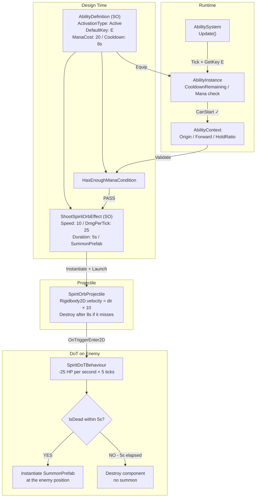
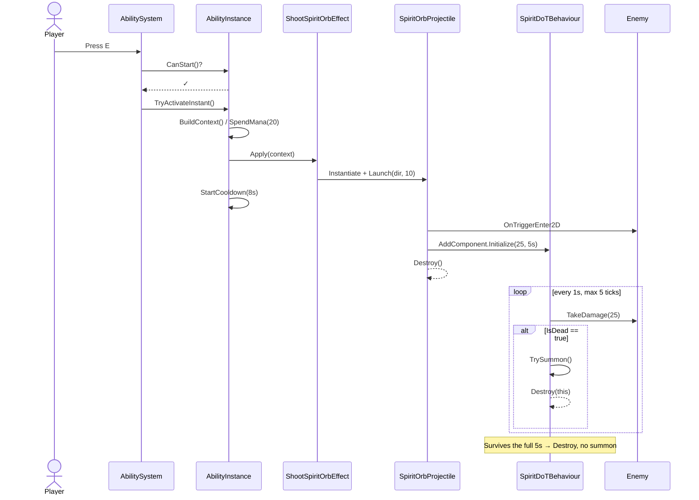
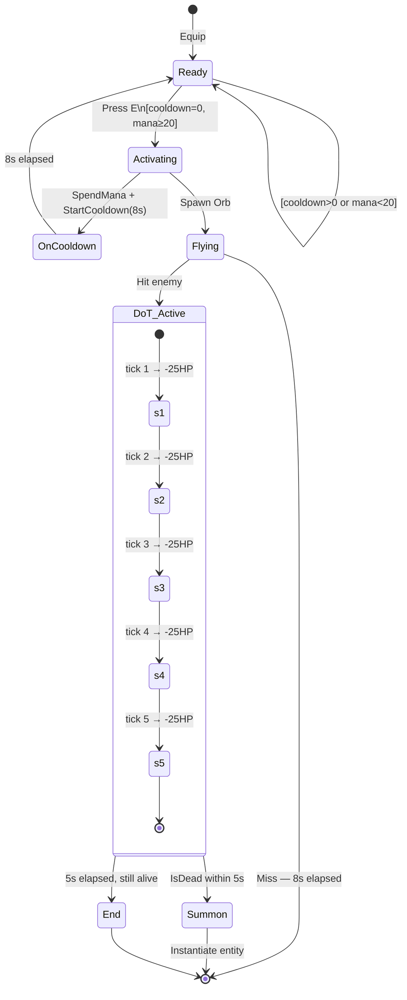

# Ability System — Diagrams

> Source: **`Assets/Script/System/Abilities/`** (originally `Assets/Skill Enhance/Scripts/`;
> parked in `prototypes/skill-enhance-abilities/Scripts/` 2026-08-22; promoted into `Assets/` 2026-09-09)
> Diagrams authored: 2026-05-20 · Status re-verified: **2026-09-11**

> ✅ **STATUS INVERTED 2026-09-11 — these diagrams now describe the ability system the PLAYER runs.**
>
> This banner previously read *"These diagrams do NOT describe the ability system the game runs"*
> and stated that the framework *"ships no SO assets, prefabs or scene wiring, so nothing can
> instantiate it"*. **Both statements are now false.** On 2026-09-09 (`9b8d40f`, `5c7afba`) all 17
> files were promoted out of `prototypes/` into `Assets/Script/System/Abilities/`, and
> `AbilityHolder` was rewritten as `: CoreComponent<Core>, IAbilityOwner` to drive them.
>
> Verified against HEAD `6d6a8e4`:
>
> - `AbilityHolder` holds `Dictionary<AbilitySlot, AbilityInstance>`, equips from a serialized
>   `abilityBindings` list in `Awake()`, and ticks every instance each frame from
>   `PlayerSkillWeaponState`.
> - Live SO assets **do** exist: `Assets/SO/Skill/ShootSpirit/ShootSpirit.asset`,
>   `Assets/SO/Skill/ShootSpirit/SpiritBomd.asset`,
>   `Assets/SO/Skill/Conditions/New Has Enough Mana Condition.asset`.
> - The framework reaches the rest of the game through `IAbilityOwner` plus injected services
>   (`IObjecPoolService`, `IPlayerStatService`, `IVitalComponent`, `IResourceReceiver`).
>
> **Two frameworks now coexist, and this document covers the second one:**
>
> | | v1 — `System/Skill_Ability/` | v2 — `System/Abilities/` (below) |
> |---|---|---|
> | Model | Subclass `ActivateSkill` | Compose an `AbilityDefinition` SO |
> | Lifecycle | `Enter → Activate → Cast → Do → Exit` | `SkillState`: `None → Start → Cast → Do → Exit` |
> | Used by | `WeaponStats`, `AttackSO`, `Weapon`, `EntityWeapon` | **`AbilityHolder` — the player** |
> | Design doc | `design/gdd/skill-ability-system.md` | **none — this file is the closest thing** |
>
> ### Read the diagrams with these deltas
>
> The structure below is accurate, but three details changed during promotion:
>
> 1. **`AbilitySystem` no longer exists as a separate driver.** Its role was absorbed into
>    `AbilityHolder`, which implements `IAbilityOwner` directly.
> 2. **`ShootSpiritOrbEffect` was renamed `ShootObjectEffect`** (`4e4eff5`) and generalised beyond
>    the spirit orb.
> 3. **`DamageInFrontEffect.Apply()` is no longer commented out**, and the 3D
>    `Physics.OverlapSphere` / non-existent `Damageable` problem noted in the old banner had to be
>    resolved for it to compile in `Assets/`.
>
> ⚠️ **The promotion did not follow `.claude/rules/prototype-code.md`'s Promotion Rules** (rewrite
> to production standards: values into SOs, null checks added, no `Find()`). Residual
> prototype-grade code remains — an unresolved TODO in `AbilityHolder.HandleInput()` and an
> unguarded `currentAbility.Definition` dereference in `GetAbility()`. There is also **no ADR**
> deciding v1's fate. Tracked as demo-checklist item 18 in `CLAUDE.md`.
>
> The original hypothesis, why it stalled, and the promotion record are in
> `prototypes/skill-enhance-abilities/README.md`.
>
> One overstatement to note before reading §4/§5: the class diagrams show `IAbilityOwner` exposing
> `CharacterStats Stats`, `Health Health` and `SimpleCharacterMotor Motor`. All three are commented
> out in the source — the interface really only exposes `Transform`. None of those three types has
> ever existed in this project.

---

## 1. Architecture Overview

```mermaid
flowchart TD
    subgraph DESIGN["Design Time"]
        SO["AbilityDefinition (SO)\nActivationType: Active\nDefaultKey: E\nManaCost: 20 / Cooldown: 8s"]
        EFF["ShootSpiritOrbEffect (SO)\nSpeed: 10 / DmgPerTick: 25\nDuration: 5s / SummonPrefab"]
        COND["HasEnoughManaCondition"]
        SO --> COND & EFF
    end

    subgraph RUNTIME["Runtime"]
        AS["AbilitySystem\nUpdate()"]
        AI["AbilityInstance\nCooldownRemaining / Mana check"]
        CTX["AbilityContext\nOrigin / Forward / HoldRatio"]
    end

    subgraph PROJECTILE["Projectile"]
        ORB["SpiritOrbProjectile\nRigidbody2D.velocity = dir × 10\nDestroy after 8s if it misses"]
    end

    subgraph ENEMY_DOT["DoT on Enemy"]
        DOT["SpiritDoTBehaviour\n-25 HP per second × 5 ticks"]
        CHECK{"IsDead within 5s?"}
        SUMMON["Instantiate SummonPrefab\nat the enemy position"]
        EXPIRE["Destroy component\nno summon"]
    end

    SO -->|Equip| AI
    AS -->|Tick + GetKey E| AI
    AI -->|CanStart ✓| CTX
    CTX -->|Validate| COND -->|PASS| EFF
    EFF -->|Instantiate + Launch| ORB
    ORB -->|OnTriggerEnter2D| DOT
    DOT --> CHECK
    CHECK -->|YES| SUMMON
    CHECK -->|NO - 5s elapsed| EXPIRE
```

---

## 2. Spirit Orb Activation Flow (Sequence Diagram)

```mermaid
sequenceDiagram
    actor P as Player
    participant AS as AbilitySystem
    participant AI as AbilityInstance
    participant EFF as ShootSpiritOrbEffect
    participant ORB as SpiritOrbProjectile
    participant DOT as SpiritDoTBehaviour
    participant E as Enemy

    P->>AS: Press E
    AS->>AI: CanStart()?
    AI-->>AS: ✓
    AS->>AI: TryActivateInstant()
    AI->>AI: BuildContext() / SpendMana(20)
    AI->>EFF: Apply(context)
    EFF->>ORB: Instantiate + Launch(dir, 10)
    AI->>AI: StartCooldown(8s)

    ORB->>E: OnTriggerEnter2D
    ORB->>DOT: AddComponent.Initialize(25, 5s)
    ORB-->>ORB: Destroy()

    loop every 1s, max 5 ticks
        DOT->>E: TakeDamage(25)
        alt IsDead == true
            DOT->>DOT: TrySummon()
            DOT-->>DOT: Destroy(this)
        end
    end
    Note over DOT: Survives the full 5s → Destroy, no summon
```

---

## 3. Ability Lifecycle (State Diagram)

```mermaid
stateDiagram-v2
    [*] --> Ready: Equip

    Ready --> Activating: Press E\n[cooldown=0, mana≥20]
    Ready --> Ready: [cooldown>0 or mana<20]
    Activating --> OnCooldown: SpendMana + StartCooldown(8s)
    OnCooldown --> Ready: 8s elapsed

    Activating --> Flying: Spawn Orb
    Flying --> [*]: Miss — 8s elapsed
    Flying --> DoT_Active: Hit enemy

    state DoT_Active {
        [*] --> s1: tick 1 → -25HP
        s1 --> s2: tick 2 → -25HP
        s2 --> s3: tick 3 → -25HP
        s3 --> s4: tick 4 → -25HP
        s4 --> s5: tick 5 → -25HP
        s5 --> [*]
    }

    DoT_Active --> Summon: IsDead within 5s
    DoT_Active --> End: 5s elapsed, still alive
    Summon --> [*]: Instantiate entity
    End --> [*]
```

---

## 4. Class Diagram — Full System (Draw.io Compatible)

```mermaid
classDiagram
    class AbilityDefinition {
        ScriptableObject
        +string Id
        +string DisplayName
        +ActivationType ActivationType
        +KeyCode DefaultKey
        +float Cooldown
        +float ManaCost
        +float MaxHoldTime
    }

    class AbilitySystem {
        MonoBehaviour
        +Equip(slot, definition)
        +Unequip(slot)
        +GetAbility(slot)
        -HandleInput()
    }

    class AbilityInstance {
        +float CooldownRemaining
        +bool IsHolding
        +float CurrentHoldTime
        +Tick(dt)
        +CanStart()
        +TryRelease()
        +TryActivateInstant()
    }

    class AbilityContext {
        +IAbilityOwner Caster
        +Vector3 Origin
        +Vector3 Forward
        +float HoldTime
        +float HoldRatio
    }

    class AbilityConditionDefinition {
        ScriptableObject
        +IsMet(context)
    }

    class AbilityEffectDefinition {
        ScriptableObject
        +Apply(context)
    }

    class IAbilityOwner {
        interface
        +Transform Transform
        +CharacterStats Stats
        +Health Health
        +SimpleCharacterMotor Motor
    }

    class HasEnoughManaCondition {
        ScriptableObject
        +IsMet(context)
    }

    class NotDeadCondition {
        ScriptableObject
        +IsMet(context)
    }

    class ShootSpiritOrbEffect {
        ScriptableObject
        +GameObject OrbPrefab
        +float Speed
        +float DamagePerTick
        +float Duration
        +GameObject SummonPrefab
        +Apply(context)
    }

    class DamageInFrontEffect {
        ScriptableObject
        +float BaseDamage
        +float BonusDamageAtMaxHold
        +float Radius
        +float Angle
        +Apply(context)
    }

    class LungeForwardEffect {
        ScriptableObject
        +float BaseDistance
        +float BonusDistanceAtMaxHold
        +Apply(context)
    }

    class SpiritOrbProjectile {
        MonoBehaviour
        +Launch(dir, speed, lifetime, dmg, dur, summon)
        -OnTriggerEnter2D(other)
    }

    class SpiritDoTBehaviour {
        MonoBehaviour
        +Initialize(dmgPerTick, duration, summonPrefab)
        -DoTRoutine()
        -TrySummon()
    }

    class PlayerAbilityOwner {
        MonoBehaviour
        +CharacterStats Stats
        +Health Health
        +SimpleCharacterMotor Motor
    }

    class SimpleCharacterMotor {
        MonoBehaviour
        +Lunge(direction, distance, duration)
    }

    class Health {
        MonoBehaviour
        +float CurrentHealth
        +bool IsDead
        +TakeDamage(float damage)
    }

    class SimpleDamageReceiver {
        MonoBehaviour
        +ReceiveDamage(float damage)
    }

    class Damageable {
        interface
        +ReceiveDamage(float damage)
    }

    class CharacterStats {
        MonoBehaviour
        +RuntimeStat Attack
        +RuntimeStat MoveSpeed
        +RuntimeStat Mana
        +float CurrentMana
        +SpendMana(float)
        +RecoverMana(float)
    }

    class RuntimeStat {
        +float BaseValue
        +float Value
        +AddModifier(modifier)
        +RemoveModifiersBySource(source)
    }

    class StatModifier {
        +StatModifierType Type
        +float Value
        +object Source
    }

    AbilitySystem --> AbilityInstance
    AbilitySystem --> IAbilityOwner
    AbilitySystem --> AbilityDefinition

    AbilityInstance --> AbilityDefinition
    AbilityInstance --> AbilityContext
    AbilityInstance --> IAbilityOwner

    AbilityDefinition --> AbilityConditionDefinition
    AbilityDefinition --> AbilityEffectDefinition

    HasEnoughManaCondition --|> AbilityConditionDefinition
    NotDeadCondition --|> AbilityConditionDefinition

    ShootSpiritOrbEffect --|> AbilityEffectDefinition
    DamageInFrontEffect --|> AbilityEffectDefinition
    LungeForwardEffect --|> AbilityEffectDefinition

    ShootSpiritOrbEffect ..> SpiritOrbProjectile
    SpiritOrbProjectile ..> SpiritDoTBehaviour
    SpiritDoTBehaviour --> Health

    PlayerAbilityOwner ..|> IAbilityOwner
    PlayerAbilityOwner --> CharacterStats
    PlayerAbilityOwner --> Health
    PlayerAbilityOwner --> SimpleCharacterMotor

    SimpleDamageReceiver ..|> Damageable
    SimpleDamageReceiver --> Health

    CharacterStats --> RuntimeStat
    RuntimeStat --> StatModifier
```

---

## 5. Class Diagram — Full Stereotypes (Standard Mermaid)

> Full version with `<<interface>>`, `<<ScriptableObject>>`, `<<MonoBehaviour>>` stereotypes — renders in GitHub, Notion and VS Code

```mermaid
classDiagram
    class AbilityDefinition {
        <<ScriptableObject>>
        +string Id
        +string DisplayName
        +AbilityActivationType ActivationType
        +KeyCode DefaultKey
        +float Cooldown
        +float ManaCost
        +float MaxHoldTime
        +List~AbilityConditionDefinition~ Conditions
        +List~AbilityEffectDefinition~ Effects
    }

    class AbilitySystem {
        <<MonoBehaviour>>
        +Equip(slot, definition)
        +Unequip(slot)
        +GetAbility(slot) AbilityInstance
        -HandleInput()
    }

    class AbilityInstance {
        +float CooldownRemaining
        +bool IsHolding
        +float CurrentHoldTime
        +Tick(dt)
        +CanStart() bool
        +StartHold()
        +CancelHold()
        +TryRelease() bool
        +TryActivateInstant() bool
    }

    class AbilityContext {
        +IAbilityOwner Caster
        +Vector3 Origin
        +Vector3 Forward
        +Vector3 TargetPoint
        +float HoldTime
        +float HoldRatio
        +AbilityInstance AbilityInstance
        +AbilityDefinition AbilityDefinition
    }

    class AbilityConditionDefinition {
        <<ScriptableObject>>
        +IsMet(context) bool
    }

    class AbilityEffectDefinition {
        <<ScriptableObject>>
        +Apply(context)
    }

    class IAbilityOwner {
        <<interface>>
        +Transform Transform
        +CharacterStats Stats
        +Health Health
        +SimpleCharacterMotor Motor
    }

    class HasEnoughManaCondition {
        <<ScriptableObject>>
        +IsMet(context) bool
    }

    class NotDeadCondition {
        <<ScriptableObject>>
        +IsMet(context) bool
    }

    class ShootSpiritOrbEffect {
        <<ScriptableObject>>
        +GameObject OrbPrefab
        +float Speed
        +float SpawnOffset
        +float OrbLifetime
        +float DamagePerTick
        +float Duration
        +GameObject SummonPrefab
        +Apply(context)
    }

    class DamageInFrontEffect {
        <<ScriptableObject>>
        +float BaseDamage
        +float BonusDamageAtMaxHold
        +float Radius
        +float Angle
        +LayerMask TargetMask
        +Apply(context)
    }

    class LungeForwardEffect {
        <<ScriptableObject>>
        +float BaseDistance
        +float BonusDistanceAtMaxHold
        +float BaseDuration
        +float MinDurationAtMaxHold
        +Apply(context)
    }

    class SpiritOrbProjectile {
        <<MonoBehaviour>>
        +Launch(dir, speed, lifetime, dmg, dur, summon)
        -OnTriggerEnter2D(other)
    }

    class SpiritDoTBehaviour {
        <<MonoBehaviour>>
        +Initialize(dmgPerTick, duration, summonPrefab)
        -DoTRoutine() IEnumerator
        -TrySummon()
    }

    class PlayerAbilityOwner {
        <<MonoBehaviour>>
        +CharacterStats Stats
        +Health Health
        +SimpleCharacterMotor Motor
    }

    class SimpleCharacterMotor {
        <<MonoBehaviour>>
        +Lunge(direction, distance, duration)
    }

    class Health {
        <<MonoBehaviour>>
        +float CurrentHealth
        +bool IsDead
        +TakeDamage(float damage)
    }

    class SimpleDamageReceiver {
        <<MonoBehaviour>>
        +ReceiveDamage(float damage)
    }

    class Damageable {
        <<interface>>
        +ReceiveDamage(float damage)
    }

    class CharacterStats {
        <<MonoBehaviour>>
        +RuntimeStat Attack
        +RuntimeStat MoveSpeed
        +RuntimeStat Mana
        +float CurrentMana
        +GetStatValue(type) float
        +SpendMana(float)
        +RecoverMana(float)
    }

    class RuntimeStat {
        +float BaseValue
        +float Value
        +AddModifier(modifier)
        +RemoveModifiersBySource(source)
    }

    class StatModifier {
        +StatModifierType Type
        +float Value
        +object Source
    }

    class AbilityActivationType {
        <<enumeration>>
        Active
        Hold
        Passive
    }

    class StatModifierType {
        <<enumeration>>
        Flat
        Percent
    }

    class StatType {
        <<enumeration>>
        Attack
        MoveSpeed
        MaxHealth
        Mana
    }

    AbilityDefinition --> AbilityActivationType
    AbilityDefinition "1" o-- "many" AbilityConditionDefinition
    AbilityDefinition "1" o-- "many" AbilityEffectDefinition

    AbilitySystem --> AbilityInstance
    AbilitySystem --> IAbilityOwner
    AbilitySystem --> AbilityDefinition

    AbilityInstance --> AbilityDefinition
    AbilityInstance --> AbilityContext
    AbilityInstance --> IAbilityOwner

    HasEnoughManaCondition --|> AbilityConditionDefinition
    NotDeadCondition --|> AbilityConditionDefinition

    ShootSpiritOrbEffect --|> AbilityEffectDefinition
    DamageInFrontEffect --|> AbilityEffectDefinition
    LungeForwardEffect --|> AbilityEffectDefinition

    ShootSpiritOrbEffect ..> SpiritOrbProjectile : Instantiate
    SpiritOrbProjectile ..> SpiritDoTBehaviour : AddComponent
    SpiritDoTBehaviour --> Health

    PlayerAbilityOwner ..|> IAbilityOwner
    PlayerAbilityOwner --> CharacterStats
    PlayerAbilityOwner --> Health
    PlayerAbilityOwner --> SimpleCharacterMotor

    SimpleDamageReceiver ..|> Damageable
    SimpleDamageReceiver --> Health

    CharacterStats --> RuntimeStat
    CharacterStats --> StatType
    RuntimeStat "1" *-- "many" StatModifier
    StatModifier --> StatModifierType
```

