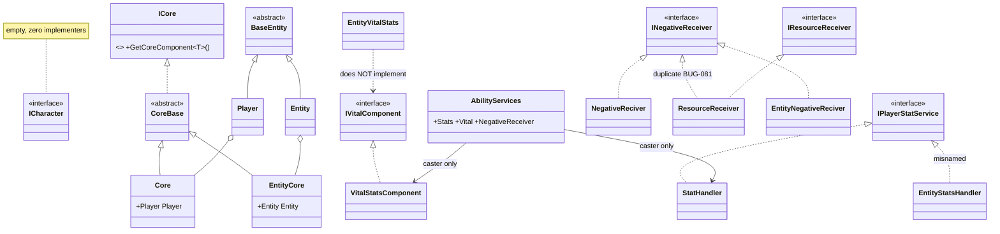
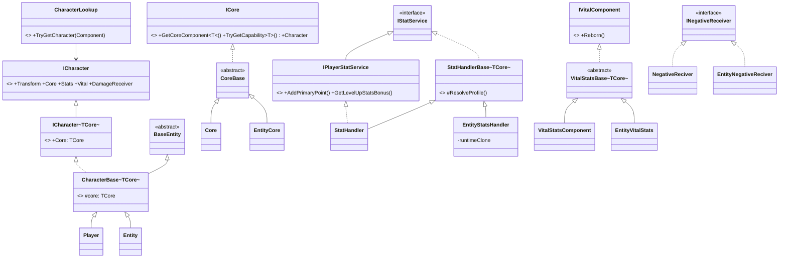
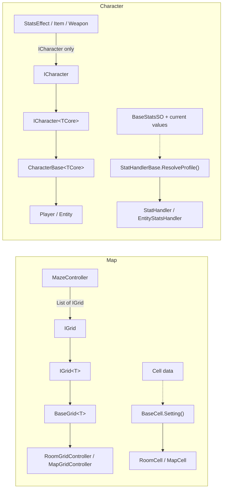
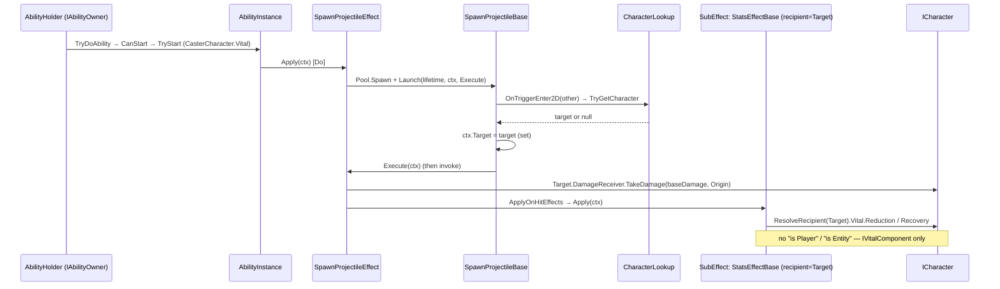
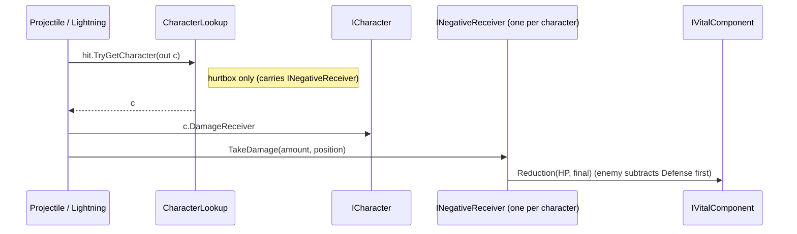
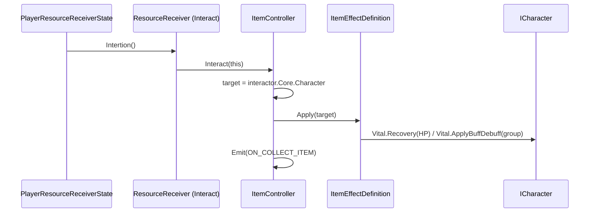
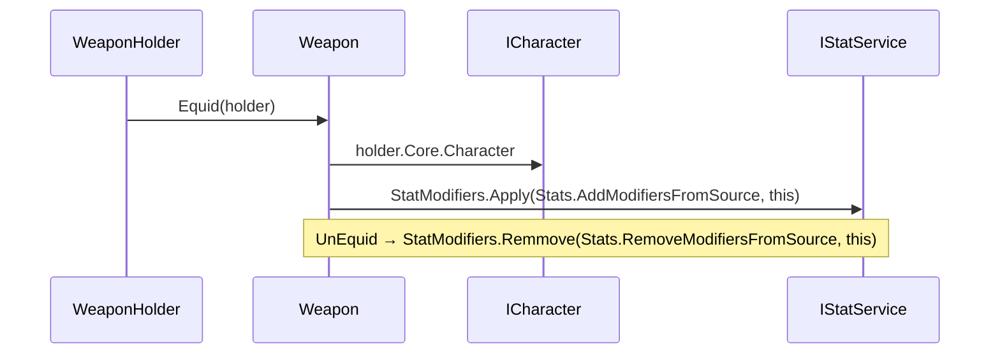
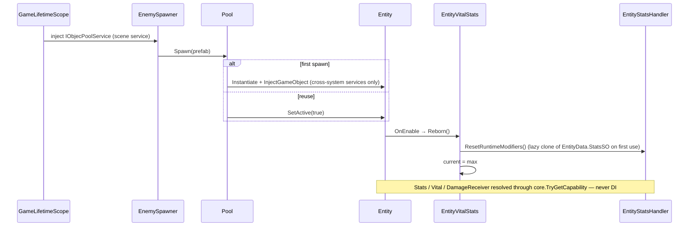

# Character Architecture — Diagrams

Companion to [ADR-0005](../architecture/adr-0005-unified-character-contract.md). Before = `85bd612`;
after = branch `demo-architeture-1`.

## 1. Class diagram — before

## 2. Class diagram — after

## 3. Correspondence with the Map precedent

## 4. Flow — stat effect on a target (player or enemy, same path)

## 5. Flow — damage (signature unchanged)

## 6. Flow — item pickup

## 7. Flow — weapon equip

## 8. Flow — DI and pooled enemy spawn

