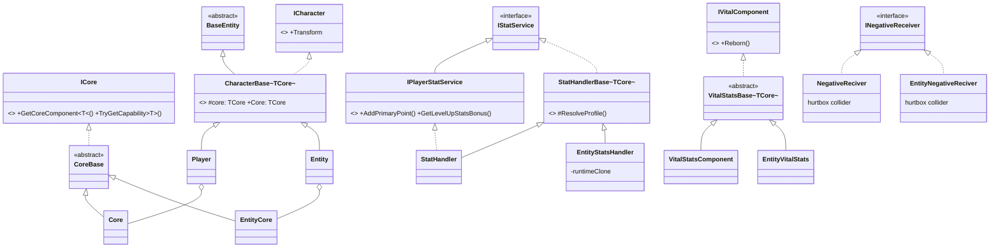
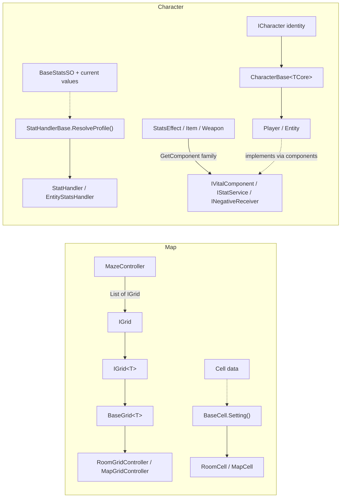
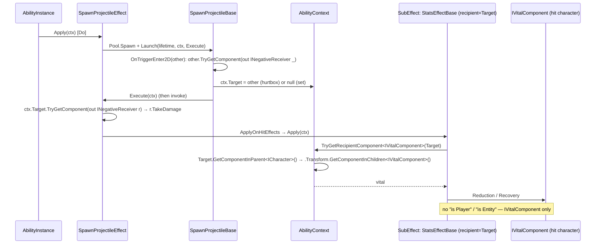
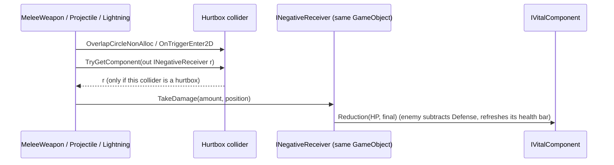
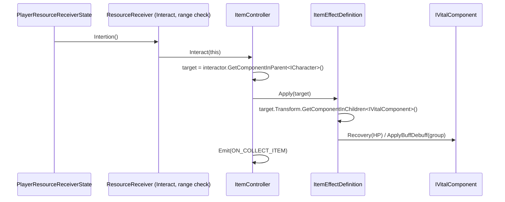
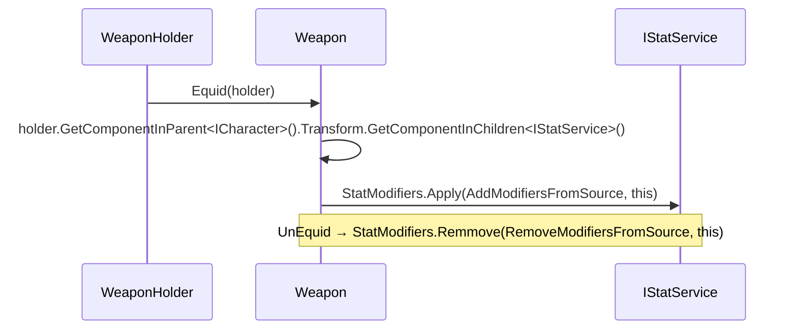
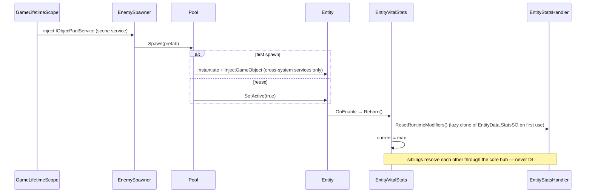
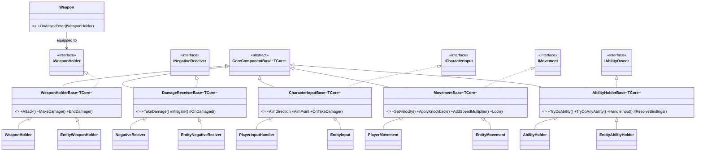

# Character Architecture — Diagrams

Companion to [ADR-0005](../architecture/adr-0005-unified-character-contract.md). Before = `85bd612`;
after = branch `demo-architeture-1`, including ADR-0005 Amendment 1 (2026-09-24).

## 1. Class diagram — before


## 2. Class diagram — after (ADR-0005 + Amendment 1)

`ICharacter` is identity only. The shared contract is the set of component interfaces both sides
implement; systems reach them with the `GetComponent` family.



### Lookup rule

| Context | Lookup |
|---|---|
| Collider hit carries the capability (hurtbox) | `hit.TryGetComponent(out INegativeReceiver r)` |
| From a child of the character (holder, interactor, hurtbox) to the root | `GetComponentInParent<ICharacter>()` |
| From the root to a capability with no collider | `character.Transform.GetComponentInChildren<IVitalComponent / IStatService>()` |
| Sibling inside the same character | `Core.GetCoreComponent<T>` / `Core.TryGetCapability<T>` |

## 3. Correspondence with the Map precedent



## 4. Flow — stat effect on a target (player or enemy, same path)



## 5. Flow — damage (signature unchanged)



## 6. Flow — item pickup



## 7. Flow — weapon equip



## 8. Flow — DI and pooled enemy spawn



## 9. Component bases (ADR-0005 Amendment 2)

Every pair derives from `CoreComponentBase<TCore>`; the base holds the shared logic, the subclass only
the side-specific part.



## 10. Flow — enemy casts an ability

```mermaid
sequenceDiagram
    participant BS as EntityBasicState
    participant AH as EntityAbilityHolder
    participant AS as EntityAbilityState
    participant AI as AbilityInstance
    BS->>AH: Processing() (cooldowns)
    BS->>AH: target locked && in attack range → TryDoAnyAbility()
    AH-->>BS: true (first ready slot; animator override applied)
    BS->>AS: ChangeState(AbilityState)
    AS->>AH: StartHold()
    loop LogicUpdate
        AS->>AH: HandleInput() — Start→Cast (pay cost)
        AS->>AH: Cast: dispatch once, hold MaxHoldTime, CancelHold → Do
        AS->>AI: Do: Execute effects, start cooldown → Exit
    end
    AS->>AS: Exit → IdleState, restore EntityData.Aima
```
