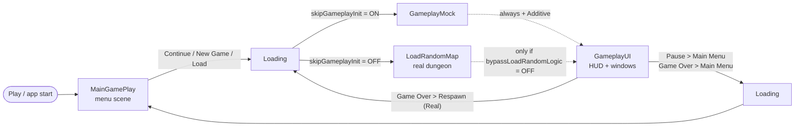
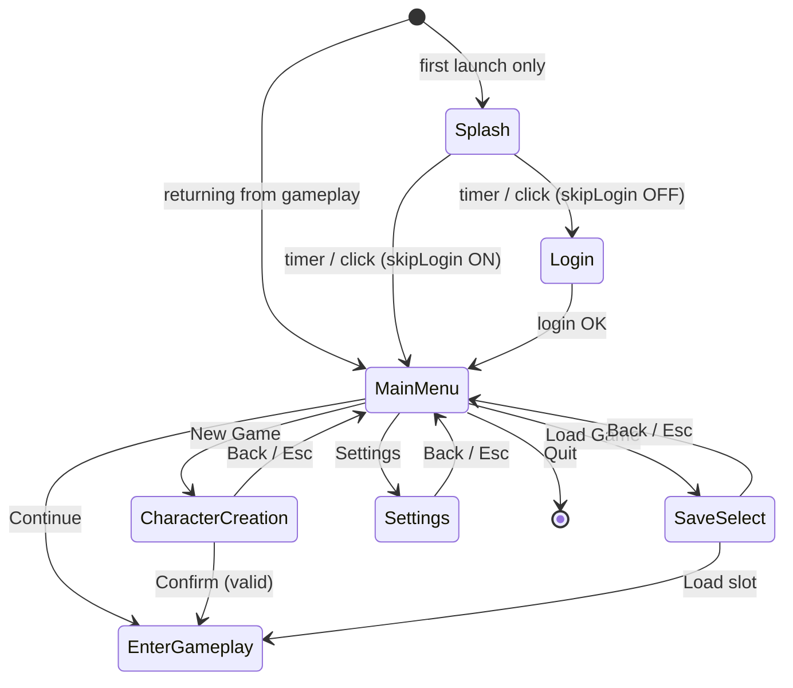
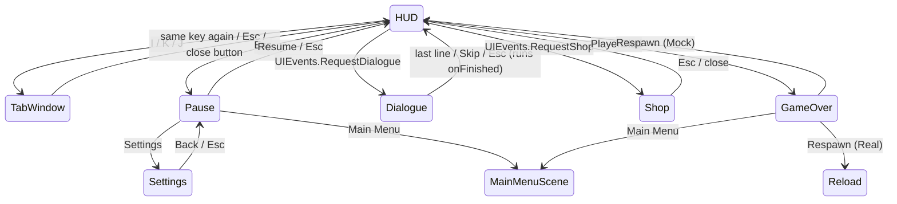

# UI / UX Flow — Current State

> **Scope:** branch `origin/feature/ui-flow-maingameplay`, HEAD `ae8be5e`, read from source on 2026-10-05.
> **Companion:** `Assets/Script/UIFlow/README.md` (beginner guide, Vietnamese, written with the code). This
> document is the end-to-end flow reference: every screen, every transition, what is real and what is mock,
> and the gaps found while reading. Nothing here was verified in Play Mode — it is static analysis.

---

## 1. The big picture

There are **three UI stacks** in the project. Only one of them is the player-facing flow.

| Stack | Tech | Where | Status |
|---|---|---|---|
| **UIFlow** (`Assets/Script/UIFlow/`, namespace `UIFlow`) | uGUI + TextMeshPro | `MainGamePlay`, `Loading`, `GameplayUI`, `GameplayMock` scenes | **The current flow.** ~6.4k lines, 74 files, added 2026-09-28/29 |
| Legacy gameplay UI | uGUI + TMP | inside `LoadRandomMap` (stats panel, minimap) and on the enemy prefab (health bar) | Live, untouched by UIFlow |
| Legacy UI Toolkit sample | UXML/USS | `UISample.unity` only (`UIController`, `StatsScreenUIController`) | Not reachable from the game flow |

Also dead or orphaned: `Assets/Script/MainMenu/MainMenu.cs` (referenced by no scene or prefab),
`Assets/Script/Manager/UI/UIManager.cs` (empty stub; not the same class as `UIFlow.UIManager`), and
`StartScene.unity` (still in Build Settings at index 5, but nothing in the new flow loads it).

Design rule UIFlow was built under: **no gameplay file is modified.** UIFlow only *listens* to gameplay
(`EventManager.ON_PLAYER_DEATH`) and *loads* the gameplay scene; everything else is mocked or stubbed, marked
`// TODO: nối logic thật` in source.

---

## 2. Scene flow



| Build index | Scene | Role |
|---|---|---|
| 0 | `Main/MainGamePlay` | Splash, login, main menu, character creation, save select, settings |
| 1 | `Main/Loading` | Shared loading screen with real `AsyncOperation` progress |
| 2 | `Main/Test/LoadRandomMap` | The real dungeon (unchanged) |
| 3 | `Main/GameplayUI` | In-game UI only; always loaded **Additive** on top of a gameplay scene |
| 4 | `Test/GameplayMock` | Fake gameplay to exercise the HUD |
| 5, 6 | `StartScene`, `SetLevel` | Legacy menu (unreachable) / level editor |

### How a transition works — `SceneFlow` (static)

1. Any caller → `SceneFlow.GoTo(target, attachGameplayUI)`:
   stores `TargetScene`, forces `Time.timeScale = 1`, and if `attachGameplayUI` subscribes once to
   `SceneManager.sceneLoaded`. Then `LoadScene("Loading")` (Single).
2. `LoadingScreen.Start()` reads `SceneFlow.TargetScene`, checks it is in Build Settings
   (`Application.CanStreamedLevelBeLoaded`; if not → error panel with "Back to menu"), then
   `LoadSceneAsync(target)` with `allowSceneActivation = false`.
3. Progress bar = `operation.progress / 0.9`, smoothed with `MoveTowards`. The screen stays at least
   `minLoadingTime` (1.5 s) and until the bar visibly reaches 100 %, then activates the scene.
   Random background colour + rotating tips (`MockCatalog.LoadingTips`) every 3 s.
4. When the target scene finishes loading, `SceneFlow.OnSceneLoaded` loads `GameplayUI` with
   **synchronous** `LoadScene(..., Additive)` — async took 16-20 s because of `backgroundLoadingPriority`.

`SceneFlow.EnterGameplay()` is the single "go play" entry point; the flags (section 3) decide which scene.
`SceneFlow.ReturnToMainMenu()` = `GoTo(MainGamePlay)`.

Why static and not a `DontDestroyOnLoad` manager or an SO: survives scene loads without putting an object
into the legacy gameplay scene, and an SO could write runtime data back into an `.asset` in the Editor
(the BUG-063 class of defect).

---

## 3. The five flags — `Assets/SO/UIFlow/UIDebugConfig.asset`

Read in exactly one place: `UIServices` (plus `SceneFlow.EnterGameplay` and `MainMenuFlow` for routing).
All five default to **ON** (UI-development mode).

| Flag | ON | OFF |
|---|---|---|
| `useMockData` | `MockPlayerDataProvider`, `MockInventoryProvider`, `MockQuestProvider` | `Real*` — mostly empty stubs (section 8) |
| `skipLogin` | Splash → Main menu | Splash → Login panel (`RealLoginService` = one "Offline" server, always succeeds) |
| `skipGameplayInit` | Enter game = `GameplayMock` | Enter game = `LoadRandomMap` |
| `skipSaveLoad` | `MockSaveProvider`: 3 sample saves in RAM | `RealSaveProvider`: JSON at `persistentDataPath/ui_saves.json` |
| `bypassLoadRandomLogic` | `LoadRandomMap` runs exactly as before, **no** new UI | `GameplayUI` is attached on top of the real map |

Also on the asset: `splashDuration` (2 s), `minLoadingTime` (1.5 s).

`UIServices` creates each provider lazily, **once**, and keeps it across scenes — so a character created in
the menu is still there in game. `UIBootstrap` (execution order −1000, one per UIFlow scene) calls
`UIServices.Init(config)`; the first scene also applies saved settings (`SettingsStore.ApplySaved()`).
If you press Play directly in `LoadRandomMap`, no bootstrap runs and `UIServices.Config` falls back to a
default instance (all flags ON).

---

## 4. Core building blocks

| Class | Job |
|---|---|
| `UIPanel` | Base of every screen. Shows/hides via `CanvasGroup` (alpha + raycast block), never `SetActive`, so state is kept. 0.12 s fade on unscaled time. Three Inspector flags: `closeOnEscape`, `hidePrevious`, `pausesGame`. Hooks: `OnShown()` (refresh content), `OnHidden()` |
| `UIManager` (one per canvas) | A **stack** of panels above a `rootPanel`. `Open` pushes (hiding the previous top if `hidePrevious`), `Close/Back` pops and re-shows the one below, `SetRoot` swaps the base screen, `CloseAll` returns to root. Esc → close top if `closeOnEscape`; empty stack → open `escapeFallbackPanel` (the pause menu). With `controlsTimeScale`, `timeScale = 0` while any open panel has `pausesGame` |
| `UIInput` | Keyboard/mouse reads through the new Input System, always null-checks `Keyboard.current` |
| `KeyBindings` | PlayerPrefs-backed key table (`ui.key.<id>`). UI keys are live; gameplay keys are only stored (section 9) |
| `SettingsStore` | PlayerPrefs for master/music/SFX volume, quality, fullscreen, VSync, resolution. Only master volume has an audible effect (no AudioMixer yet) |
| `UIEvents` | UIFlow's own static event channel: `RequestDialogue`, `RequestShop`, `Notify`, `ShowDamage`, `UseSkill`. Gameplay is meant to call these; today only `GameplayMock` does |
| `UIServices` | Mock/Real provider switch (section 3) |

Panel flags as built by `UIFlowBuilder`:

| Panel | closeOnEscape | hidePrevious | pausesGame |
|---|---|---|---|
| Splash, Login, MainMenu | no | yes | — |
| CharacterCreation, SaveSelect, Settings | yes | yes | — |
| HUD (root) | no | no | no |
| TabWindow, Shop | yes | yes | **yes** |
| Dialogue, Pause | yes | **no** (overlay) | **yes** |
| GameOver | **no** | yes | **yes** |

---

## 5. Menu scene — `MainGamePlay`

`MainMenuFlow` is the only class that decides navigation; panels just raise events
(`Finished`, `LoggedIn`, `ContinueClicked`, `CharacterCreated`, `SaveChosen`…).



**Splash** — logo grows slightly for `splashDuration`; click / Space / Enter skips. Shown once per app run
(`MainMenuFlow._splashShown`, static).

**Login** — username/password fields (password masked), server list built from `ILoginService.GetServers`
with status colour and ping, auto-selects the first Online server. Callback-based so a network
implementation can drop in later. Root panel, so Esc does nothing.

**Main menu** — buttons: Continue, New Game, Load Game, Settings, Quit.
- *Continue* is shown only when a save exists, shows "Name · Class Lv.N · Location", is enlarged,
  highlighted and pre-selected (Enter = play). Otherwise New Game gets the emphasis.
- *Load Game* is disabled when there are no saves.
- `OnShown()` recomputes all this every time the menu becomes visible again (e.g. after deleting saves).
- *Continue* → selects the most recent save (`GetMostRecent`) → `EnterGameplay()`.

**Character creation** — class list (from `IPlayerDataProvider.GetAvailableClasses`), hair / skin / outfit
cyclers, name field (2-16 chars, pre-filled with a random name), 8-direction preview using the project's
`DirectionResolver` convention (0 = down-left, clockwise) with rotate buttons and auto-rotate, Random
button. Confirm → `ISaveProvider.CreateNewSave` → selects it → `EnterGameplay()`. Without direction sprites
the preview is a colour block plus an arrow.

**Save select** — one row per save (name, class, level, play time, location, last saved). Delete is a
two-click confirm. Load → select slot → `EnterGameplay()`.

**Settings** (shared with the in-game pause menu) — three tabs:
- *Audio:* master / music / SFX sliders — apply immediately.
- *Graphics:* resolution, quality, fullscreen, VSync — apply immediately (resolution only in builds).
- *Keys:* one row per `KeyBindings` entry. Click → "press a key"; Esc cancels (except when rebinding
  Pause itself); a conflicting binding gets the old key swapped onto it, with a message. While listening,
  `UIManager.BlockEscape` stops Esc from closing the panel and is released one frame later. Reset button.
- No Apply/Cancel: every change is live; PlayerPrefs are flushed when the panel hides.

---

## 6. In-game UI — `GameplayUI` (additive)

One overlay canvas (sorting order 10) with `UIManager` (root = HUD, Esc fallback = Pause,
`controlsTimeScale = true`) and `GameplayUIController`, plus a `DamageNumbers` pool. It brings no camera
and no EventSystem; `GameplayUIController.Start()` creates an EventSystem only if the host scene lacks one.

### 6.1 HUD (root panel, always under everything)

| Area (anchor) | Content | Data source |
|---|---|---|
| Top-left | Level badge, name + class, HP / Mana / EXP bars | `IPlayerDataProvider.GetStats()` + `StatsChanged` event (no polling) |
| Top-right | Minimap | **Placeholder box** with the text "TODO … (MapGridController)" |
| Right | Quest tracker (tracked quests only) | `IQuestProvider` + `Changed` |
| Bottom-centre | Skill hotbar with radial cooldown overlay | `GetHotbar()`; cooldown fires on `UIEvents.UseSkill(index)` |
| Left-centre | Notification feed — auto-fading lines, pooled, max N | `UIEvents.Notify(text)` |
| — | Key hints | static |

`StatBar` has two layers: the fill jumps, a trailing bar drains behind it so damage taken is readable.

### 6.2 Panels and how to reach them



- **Hotkeys** (`GameplayUIController.Update`) only work when at the HUD or when the tab window is on top,
  so I/K/J never open on top of dialogue, shop, pause or Game Over.
- **Tab window** — tabs Inventory (0), Character (1), Skill tree (2), Quests (3). I/K/J open the matching
  tab; pressing the key of the tab already showing closes the window. Q/E cycle tabs (wrap-around).
  Pauses the game.
  - *Inventory:* 24-slot grid; drag-and-drop swaps slots (ghost icon has `raycastTarget = false`);
    right-click equips (the previously equipped item returns to that slot); hover tooltip coloured by rarity
    with a green/red stat comparison against the equipped item, flips at screen edges.
  - *Character:* name, class, level, EXP, all attributes; refreshes on `StatsChanged`.
  - *Skill tree:* rows by tier; green = learned, white = learnable, grey = not enough points or missing
    prerequisite; "Learn" spends points via `TryUnlockSkill`.
  - *Quests:* list on the left, detail and objectives on the right, Track toggle feeds the HUD tracker.
- **Dialogue** — typewriter via TMP `maxVisibleCharacters`. Click/Space/Enter while typing = show the full
  line; after = next line. Fast-forward toggle, Skip button, Esc. **Any** close (end, Skip, Esc) runs the
  `onFinished` callback — in the mock that opens the shop.
- **Shop** — left column NPC stock (Buy), right column player inventory (Sell), gold display, message line,
  same comparison tooltip. Everything goes through `IInventoryProvider`; the panel redraws on `Changed`.
- **Pause** — Resume, Save (disabled when no slot is selected), Settings, Main Menu. Save →
  `ISaveProvider.SaveCurrent()` → notification "Saved" / "Save failed".
- **Game Over** — Respawn or Main Menu; Esc cannot dismiss it. Opened by `IPlayerDataProvider.PlayerDied`,
  which first `CloseAll()`s the stack.

### 6.3 World-space UI

- `WorldHealthBar` — World Space canvas (scale 0.01 → 100 px = 1 unit), follows a target without being
  parented (so sprite flips do not mirror it). **Used only by `MockEnemy`.** Real enemies keep their own
  `EntityUIController` bar on `EnemyPrefab.prefab`.
- `DamageNumber` / `DamageNumberSpawner` — 3D `TextMeshPro` (no canvas), pooled in a `Queue`, triggered by
  `UIEvents.ShowDamage(pos, amount, crit)`. **Nothing in real gameplay calls it yet.**

---

## 7. `GameplayMock` — the test harness

Scene with a fake player, a blacksmith NPC, three slimes (`MockEnemy` + `WorldHealthBar`) and
`GameplayMockController`. Controls (ignored while `timeScale == 0`):

| Input | Effect |
|---|---|
| Left click a slime (Shift = crit) | Damage number + bar drop; at 0 HP: "+120 EXP", respawns after 2 s |
| `1`-`5` | `UIEvents.UseSkill(i)` → hotbar cooldown |
| `H` / `M` / `X` | −25 HP / −15 Mana / +300 EXP (HP 0 → Game Over) |
| `T` | NPC dialogue, then the shop opens |
| `B` / `U` / `N` | Shop / advance a quest objective / test notification |
| `I` `K` `J`, `Q` `E`, `Esc` | Windows, tab cycling, back/pause |

Mock data lives in `MockCatalog` (items, classes, tips, dialogue) and the `Mock*Provider` classes
(3 saves, the newest is "Aria"; 4 skill points; mock `Respawn()` refills HP/Mana in place).

---

## 8. What is real vs mock today

| Interface | Mock | Real |
|---|---|---|
| `ISaveProvider` | 3 saves in RAM | **Works** — slot metadata to `ui_saves.json`. Does not save any gameplay state (room, stats, items) and the selected slot is not passed into the dungeon |
| `ILoginService` | Server list with statuses | One "Offline" server, always succeeds |
| `IPlayerDataProvider` | Full | **Only `PlayerDied` is wired** (listens to `ON_PLAYER_DEATH`, de-duplicated because BUG-086 emits it every frame). `GetStats()` returns placeholders, `StatsChanged` never fires, no classes, no hotbar, no skill tree. `Respawn()` reloads the gameplay scene through Loading (BUG-087: there is no in-place rebirth) |
| `IInventoryProvider` | Full | Empty 24-slot bag, 0 gold, shop refuses ("not connected") |
| `IQuestProvider` | Full | Empty list |

Integration points the real game still has to call:

| UIFlow expects | Real source that exists | Status |
|---|---|---|
| HP / Mana current + max, `StatsChanged` | `IVitalComponent` (current), `IPlayerStatService` (max) | Not wired; there is no `ON_PLAYER_TAKE_DAMAGE` event either |
| Hotbar slots | `PlayerData.AbilityBindings` (Primary/Secondary/Utility/Ultimate on keys 1-4) | Not wired |
| `UIEvents.UseSkill` | `AbilityHolder.TryDoAbility` | Not called |
| `UIEvents.ShowDamage` | `INegativeReceiver.TakeDamage` implementers | Not called |
| `UIEvents.Notify` (pickups) | Item system (`ON_COLLECT_ITEM`) | Not called |
| Minimap | `MapGridController` (in `LoadRandomMap`'s own canvas) | Placeholder only |

---

## 9. Findings — gaps and risks (from reading source)

Ordered by how much they affect someone actually playing the flow.

1. **All flags OFF on a fresh install = no way into the game.** With `useMockData` OFF the class list is
   empty, so Character Creation disables Confirm (it does show "no class available"). With
   `skipSaveLoad` OFF and no `ui_saves.json` yet, Continue is hidden and Load Game is disabled. Every path
   to `EnterGameplay()` is closed. The smoke test does not hit this because it calls `EnterGameplay()`
   directly in steps 33-37. Fix: give `RealPlayerDataProvider.GetAvailableClasses()` one Paladin entry.
2. **The HUD on the real map shows the player as empty/dead.** With `bypassLoadRandomLogic` OFF,
   `RealPlayerDataProvider.GetStats()` returns `currentHP = 0, maxHP = 1` → the HP bar reads "0 / 1",
   Mana "0 / 1", name "?" and an empty hotbar, on top of a player who is alive. Wire `GetStats()` to
   `IVitalComponent` / `IPlayerStatService` before switching this flag off for anyone else.
3. **Pausing does not stop player input (needs Play Mode check).** `timeScale = 0` freezes physics and
   animation, but `BaseEntity.Update()` still ticks `LogicUpdate()`, and the left mouse button is the
   Attack binding. Clicking Pause/Shop/Inventory buttons while paused on the real map can therefore queue
   attacks or state changes that play out on resume. Usual fix: disable the `Control` action map while a
   `pausesGame` panel is open.
4. **Gameplay key rebinding looks live but is not.** Settings lists Move, Dash, Equip, Interact as
   rebindable; the new key is only stored in PlayerPrefs (`ApplyBindingOverride` is a TODO). The list also
   omits the real ability keys (1-4), Q (pickup, `ResourceReceiver`) and mouse Attack/Block, so conflict
   detection cannot warn that e.g. Inventory → `1` collides with Primary Ability. Either hide gameplay rows
   until overrides are applied, or apply them.
5. **Placeholder minimap over the real one.** The HUD draws a 280×280 "MINIMAP TODO" box top-right at
   sorting order 10, above `LoadRandomMap`'s own canvas, which already contains `MiniMap`/`MainMap`. Check
   whether it covers the real minimap; hide the placeholder when the host scene has one.
6. **Two health-bar and two damage paths.** `WorldHealthBar` + `DamageNumber` (UIFlow, mock-only) vs
   `EntityUIController` (real enemies). Decide which one survives before wiring real damage numbers.
7. **Stale comment.** `TabWindow` says Q/E are gameplay keys; E is no longer bound (abilities moved to
   1-4), Q is pickup. The pause-while-open behaviour is still correct.
8. **Static subscription after `RebuildProviders()`.** `GameplayUIController` and `HUDPanel` subscribe to
   the provider instance that existed at `OnEnable`. Rebuilding providers mid-scene (smoke test, debug)
   leaves them on the old instance. Debug-only today.
9. **Language.** All player-facing strings are Vietnamese literals in code and in the builder
   (`ui-code.md` asks for constants or a data source). Fine for now; a localisation pass will have to touch
   every panel.
10. **Settings audio.** Music/SFX sliders store values only — there is no `AudioMixer`.
11. **No GDD / UX spec / ADR** for UIFlow, `UIServices` (a static service switch alongside VContainer) or
    the additive-scene pattern. BUG-052 already tracks "UI layer has no ADR"; this widens it.

What is solid: the panel stack + Esc model, CanvasGroup show/hide, unscaled-time fades, the
loading-screen guard for scenes missing from Build Settings, `timeScale` reset on every scene change and in
`UIManager.OnDestroy`, de-duplication of the per-frame death event, and the 37-step smoke test.

---

## 10. Working on it

- **Run:** open `Assets/Scenes/Main/MainGamePlay.unity` → Play.
- **Smoke test:** `Tools > UI Flow > Run Smoke Test` → Console `RESULT: PASS` (37 steps; steps 31-37 switch
  all flags off and load the real `LoadRandomMap`).
- **Layout lives in code.** `Tools > UI Flow > Build All` regenerates the four UIFlow scenes, the two
  prefabs and the config from `UIFlowBuilder*.cs` — **manual edits to those scenes are overwritten.** Change
  layout in the builder, or stop using the builder for that scene. `Update Build Settings Only` is safe.
- **Add a screen:** subclass `UIPanel`, override `OnShown()`, open it with `uiManager.Open(panel)`; let the
  flow class (`MainMenuFlow` / `GameplayUIController`) own navigation, not the panel.
- **Feed it from gameplay:** implement the `Real*` provider, or call `UIEvents.*`. Do not reference panels
  from gameplay code.
- After Play Mode, discard TMP's auto-edited `LiberationSans SDF - Fallback.asset`.

### File map

```
Assets/Script/UIFlow/
  Core/      SceneFlow, SceneNames, UIBootstrap, UIDebugConfig, UIServices, UIManager, UIPanel, UIInput, UIEvents
  Data/      UIDataModels (ItemData, PlayerStatsData, SaveSlotData, QuestData, SkillNodeData, …)
  Services/  Interfaces/ · Mock/ (+ MockCatalog) · Real/ · KeyBindings · SettingsStore
  Menu/      SplashPanel, LoginPanel, MainMenuPanel, CharacterCreationPanel, SaveSelectPanel (+SaveSlotView),
             SettingsPanel (+KeyBindingRow), MainMenuFlow
  Loading/   LoadingScreen
  Gameplay/  GameplayUIController, PausePanel, GameOverPanel
             HUD/ (HUDPanel, StatBar, SkillHotbar, QuestTracker, NotificationFeed)
             Windows/ (TabWindow, InventoryPanel, InventorySlot, ItemTooltip, CharacterPanel, SkillTreePanel, QuestPanel)
             Dialogue/, Shop/, World/ (WorldHealthBar, DamageNumber, DamageNumberSpawner), Mock/
  Editor/    UIKit, UIFlowBuilder (+.Gameplay), UIFlowSmokeTest
Assets/SO/UIFlow/UIDebugConfig.asset · Assets/Prefab/UIFlow/{DamageNumber,WorldHealthBar}.prefab
Assets/Scenes/Main/{MainGamePlay,Loading,GameplayUI}.unity · Assets/Scenes/Test/GameplayMock.unity
```
