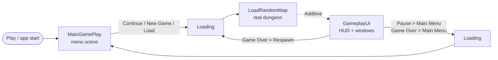
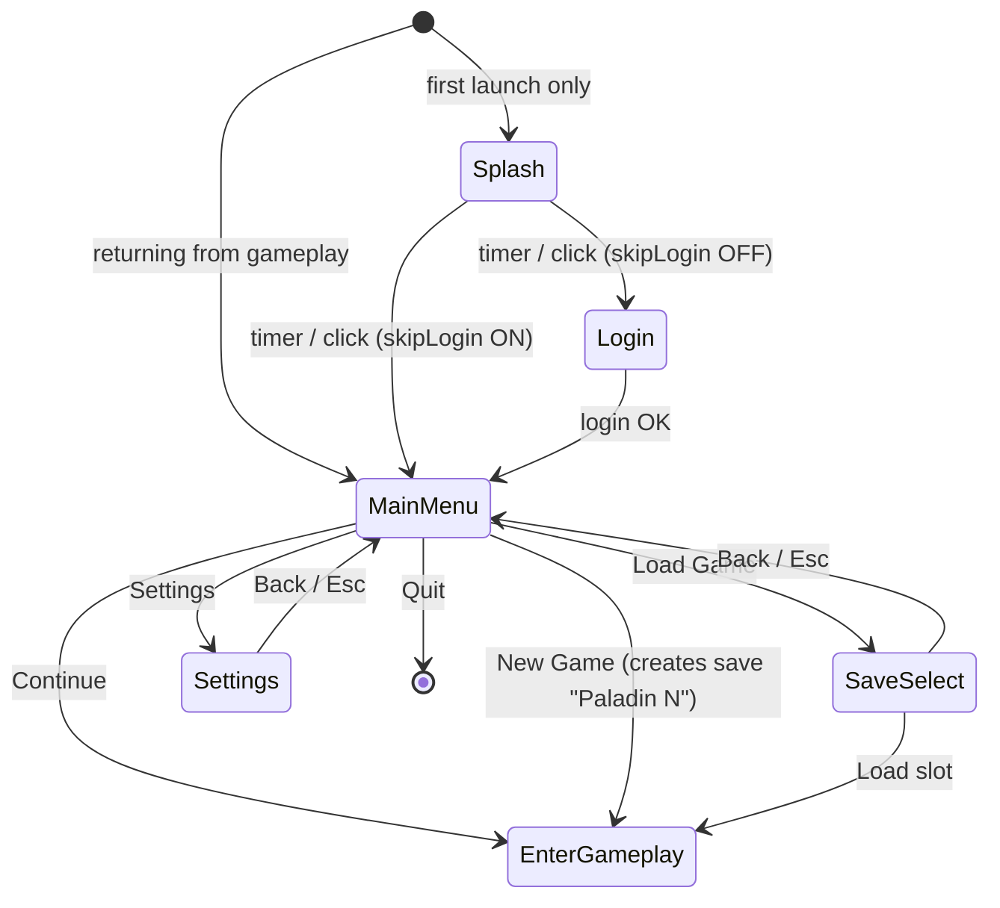
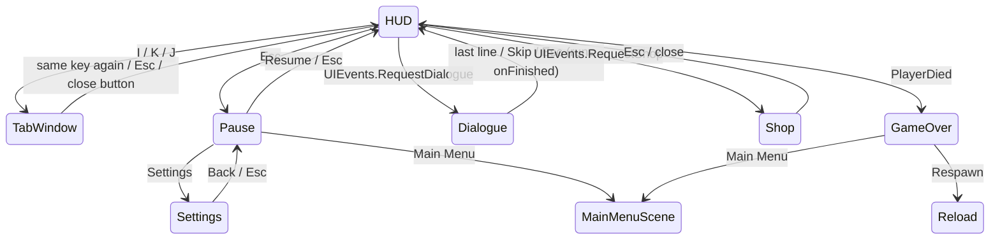

# UI / UX Flow — Current State

> 📜 Change log: [changelog/ui-ux-flow.CHANGELOG.md](changelog/ui-ux-flow.CHANGELOG.md)

> **Scope:** branch `origin/feature/ui-flow-maingameplay`, read from source on 2026-10-05.
> **Updated 2026-10-05 (game-completion phase):** flags now default to the **real** game (New Game / Continue load
> `LoadRandomMap`, the HUD reads the real player), character creation is removed, and every UI asset dating from
> before February 2026 is deleted. Findings 1, 2, 5 and 7 in section 9 are resolved by that change.
> **Updated 2026-10-05 (mock removal):** every mock / test-only path is deleted — the `GameplayMock` scene,
> `Services/Mock/` (incl. `MockCatalog`), `Gameplay/Mock/`, `WorldHealthBar`, the smoke test and the four mock
> flags. `UIServices` always builds the `Real*` providers and New Game / Continue always load `LoadRandomMap`
> with `GameplayUI` attached.
> **Companion:** `Assets/Script/UIFlow/README.md` (beginner guide, Vietnamese, written with the code). This
> document is the end-to-end flow reference: every screen, every transition, what is wired to gameplay and what is still empty,
> and the gaps found while reading. Nothing here was verified in Play Mode — it is static analysis.

---

## 1. The big picture

There are **three UI stacks** in the project. Only one of them is the player-facing flow.

| Stack | Tech | Where | Status |
|---|---|---|---|
| **UIFlow** (`Assets/Script/UIFlow/`, namespace `UIFlow`) | uGUI + TextMeshPro | `MainGamePlay`, `Loading`, `GameplayUI` scenes | **The current flow.** ~5k lines, 54 files, added 2026-09-28/29 |
| Legacy gameplay UI | uGUI + TMP | inside `LoadRandomMap` (stats panel, minimap) and on the enemy prefab (health bar) | Live, untouched by UIFlow |
| Legacy UI Toolkit screens | UXML/USS | `UIController`, `StatsScreenUIController` + `Assets/UI/Screens/*.uxml` | Code kept, but no scene uses it since `UISample.unity` was deleted |

**Deleted on 2026-10-05** (UI from before February 2026): `StartScene.unity` (2024 menu, removed from Build
Settings), `UISample.unity` (2025), `Assets/Script/MainMenu/MainMenu.cs`, the empty
`Assets/Script/Manager/UI/UIManager.cs` stub, and `Assets/Prefab/UI/{Canvas,ChoiceText,Content,HealthBar,ManaBar}.prefab`
(2024, built from scripts that no longer exist; the nested `Canvas` instance was also removed from
`Assets/Prefab/Core/CoreGame.prefab`). `UIController` and `StatsScreenUIController` (August 2026) are kept but
no scene uses them now that `UISample` is gone.

**Kept unchanged:** the UI that lives inside `LoadRandomMap` (stats panel via `StatsUIController`, minimap via
`MapGridController`) and the enemy health bar (`EntityUIController`).

UIFlow originally modified no gameplay file. To feed the HUD real data, three gameplay **events** were added
(no behaviour change): `EventID.ON_PLAYER_READY`, `IVitalComponent.CurrentStatsChanged` and
`AbilityHolderBase.AbilityCooldownStarted` (section 8). What gameplay still lacks (inventory, quests, EXP, skill
tree) stays stubbed, marked `// TODO: nối logic thật` in source.

---

## 2. Scene flow



| Build index | Scene | Role |
|---|---|---|
| 0 | `Main/MainGamePlay` | Splash, login, main menu, save select, settings |
| 1 | `Main/Loading` | Shared loading screen with real `AsyncOperation` progress |
| 2 | `Main/Test/LoadRandomMap` | The real dungeon (unchanged) |
| 3 | `Main/GameplayUI` | In-game UI only; always loaded **Additive** on top of a gameplay scene |
| 4 | `SetLevel` | Level editor |

### How a transition works — `SceneFlow` (static)

1. Any caller → `SceneFlow.GoTo(target, attachGameplayUI)`:
   stores `TargetScene`, forces `Time.timeScale = 1`, and if `attachGameplayUI` subscribes once to
   `SceneManager.sceneLoaded`. Then `LoadScene("Loading")` (Single).
2. `LoadingScreen.Start()` reads `SceneFlow.TargetScene`, checks it is in Build Settings
   (`Application.CanStreamedLevelBeLoaded`; if not → error panel with "Back to menu"), then
   `LoadSceneAsync(target)` with `allowSceneActivation = false`.
3. Progress bar = `operation.progress / 0.9`, smoothed with `MoveTowards`. The screen stays at least
   `minLoadingTime` (1.5 s) and until the bar visibly reaches 100 %, then activates the scene.
   Random background colour + rotating tips (`LoadingScreen.DefaultTips` unless the Inspector list is filled) every 3 s.
4. When the target scene finishes loading, `SceneFlow.OnSceneLoaded` loads `GameplayUI` with
   **synchronous** `LoadScene(..., Additive)` — async took 16-20 s because of `backgroundLoadingPriority`.

`SceneFlow.EnterGameplay()` is the single "go play" entry point: `GoTo(LoadRandomMap, attachGameplayUI: true)`.
`SceneFlow.ReturnToMainMenu()` = `GoTo(MainGamePlay)`.

Why static and not a `DontDestroyOnLoad` manager or an SO: survives scene loads without putting an object
into the legacy gameplay scene, and an SO could write runtime data back into an `.asset` in the Editor
(the BUG-063 class of defect).

---

## 3. Configuration — `Assets/SO/UIFlow/UIDebugConfig.asset`

No mock flags remain (removed 2026-10-05). The asset holds three settings:

| Field | Default | Effect |
|---|---|---|
| `skipLogin` | ON | Splash → Main menu. OFF: Splash → Login panel (`RealLoginService` = one "Offline" server, always succeeds) |
| `splashDuration` | 2 s | Splash time |
| `minLoadingTime` | 1.5 s | Minimum loading-screen time |

`UIServices` creates each provider lazily, **once**, and keeps it across scenes — so the save chosen in the
menu is still selected in game. `UIBootstrap` (execution order −1000, one per UIFlow scene) calls
`UIServices.Init(config)`; the first scene also applies saved settings (`SettingsStore.ApplySaved()`).
`UIBootstrap` also creates the player provider eagerly, so the real one is already listening for
`ON_PLAYER_READY` before `LoadRandomMap` starts. If you press Play directly in `LoadRandomMap`, no bootstrap runs,
`UIServices.Config` falls back to the code defaults, and no `GameplayUI` is attached (only `SceneFlow` attaches it).

---

## 4. Core building blocks

| Class | Job |
|---|---|
| `UIPanel` | Base of every screen. Shows/hides via `CanvasGroup` (alpha + raycast block), never `SetActive`, so state is kept. 0.12 s fade on unscaled time. Three Inspector flags: `closeOnEscape`, `hidePrevious`, `pausesGame`. Hooks: `OnShown()` (refresh content), `OnHidden()` |
| `UIManager` (one per canvas) | A **stack** of panels above a `rootPanel`. `Open` pushes (hiding the previous top if `hidePrevious`), `Close/Back` pops and re-shows the one below, `SetRoot` swaps the base screen, `CloseAll` returns to root. Esc → close top if `closeOnEscape`; empty stack → open `escapeFallbackPanel` (the pause menu). With `controlsTimeScale`, `timeScale = 0` while any open panel has `pausesGame` |
| `UIInput` | Keyboard/mouse reads through the new Input System, always null-checks `Keyboard.current` |
| `KeyBindings` | PlayerPrefs-backed key table (`ui.key.<id>`). UI keys are live; gameplay keys are only stored (section 9) |
| `SettingsStore` | PlayerPrefs for master/music/SFX volume, quality, fullscreen, VSync, resolution. Only master volume has an audible effect (no AudioMixer yet) |
| `UIEvents` | UIFlow's own static event channel: `RequestDialogue`, `RequestShop`, `Notify`, `ShowDamage`, `UseSkill`. Gameplay is meant to call these; today only `UseSkill` is raised (by `RealPlayerDataProvider`) |
| `UIServices` | Creates the `Real*` providers once and keeps them across scenes |

Panel flags as built by `UIFlowBuilder`:

| Panel | closeOnEscape | hidePrevious | pausesGame |
|---|---|---|---|
| Splash, Login, MainMenu | no | yes | — |
| SaveSelect, Settings | yes | yes | — |
| HUD (root) | no | no | no |
| TabWindow, Shop | yes | yes | **yes** |
| Dialogue, Pause | yes | **no** (overlay) | **yes** |
| GameOver | **no** | yes | **yes** |

---

## 5. Menu scene — `MainGamePlay`

`MainMenuFlow` is the only class that decides navigation; panels just raise events
(`Finished`, `LoggedIn`, `ContinueClicked`, `CharacterCreated`, `SaveChosen`…).



**Splash** — logo grows slightly for `splashDuration`; click / Space / Enter skips. Shown once per app run
(`MainMenuFlow._splashShown`, static).

**Login** — username/password fields (password masked), server list built from `ILoginService.GetServers`
with status colour and ping, auto-selects the first Online server. Callback-based so a network
implementation can drop in later. Root panel, so Esc does nothing.

**Main menu** — buttons: Continue, New Game, Load Game, Settings, Quit.
- *Continue* is shown only when a save exists, shows "Name · Class Lv.N · Location", is enlarged,
  highlighted and pre-selected (Enter = play). Otherwise New Game gets the emphasis.
- *Load Game* is disabled when there are no saves.
- `OnShown()` recomputes all this every time the menu becomes visible again (e.g. after deleting saves).
- *Continue* → selects the most recent save (`GetMostRecent`) → `EnterGameplay()`.

**New Game** — there is no character-creation screen any more (removed 2026-10-05). `MainMenuFlow.OnNewGame()`
calls `ISaveProvider.CreateNewSave` with name `"Paladin N"` (N = save count + 1) and class `Paladin`, the
game's only class, selects it and calls `EnterGameplay()`.

**Save select** — one row per save (name, class, level, play time, location, last saved). Delete is a
two-click confirm. Load → select slot → `EnterGameplay()`.

**Settings** (shared with the in-game pause menu) — three tabs:
- *Audio:* master / music / SFX sliders — apply immediately.
- *Graphics:* resolution, quality, fullscreen, VSync — apply immediately (resolution only in builds).
- *Keys:* one row per `KeyBindings` entry. Click → "press a key"; Esc cancels (except when rebinding
  Pause itself); a conflicting binding gets the old key swapped onto it, with a message. While listening,
  `UIManager.BlockEscape` stops Esc from closing the panel and is released one frame later. Reset button.
- No Apply/Cancel: every change is live; PlayerPrefs are flushed when the panel hides.

---

## 6. In-game UI — `GameplayUI` (additive)

One overlay canvas (sorting order 10) with `UIManager` (root = HUD, Esc fallback = Pause,
`controlsTimeScale = true`) and `GameplayUIController`, plus a `DamageNumbers` pool. It brings no camera
and no EventSystem; `GameplayUIController.Start()` creates an EventSystem only if the host scene lacks one.

### 6.1 HUD (root panel, always under everything)

| Area (anchor) | Content | Data source |
|---|---|---|
| Top-left | Level badge, name + class, HP / Mana bars (EXP bar hidden while gameplay has no EXP) | `IPlayerDataProvider.GetStats()` + `StatsChanged` event (no polling) |
| Top-right | Minimap placeholder — **inactive** | `LoadRandomMap` already shows its own minimap (`MapGridController`) |
| Right | Quest tracker (tracked quests only) | `IQuestProvider` + `Changed` |
| Bottom-centre | Skill hotbar (4 slots, keys 1-4, ability icon) with radial cooldown overlay | `GetHotbar()` + `HotbarChanged`; cooldown fires on `UIEvents.UseSkill(index)` |
| Left-centre | Notification feed — auto-fading lines, pooled, max N | `UIEvents.Notify(text)` |
| — | Key hints | static |

`StatBar` has two layers: the fill jumps, a trailing bar drains behind it so damage taken is readable.

### 6.2 Panels and how to reach them



- **Hotkeys** (`GameplayUIController.Update`) only work when at the HUD or when the tab window is on top,
  so I/K/J never open on top of dialogue, shop, pause or Game Over.
- **Tab window** — tabs Inventory (0), Character (1), Skill tree (2), Quests (3). I/K/J open the matching
  tab; pressing the key of the tab already showing closes the window. Q/E cycle tabs (wrap-around).
  Pauses the game.
  - *Inventory:* 24-slot grid; drag-and-drop swaps slots (ghost icon has `raycastTarget = false`);
    right-click equips (the previously equipped item returns to that slot); hover tooltip coloured by rarity
    with a green/red stat comparison against the equipped item, flips at screen edges.
  - *Character:* name, class, level, EXP, all attributes; refreshes on `StatsChanged`.
  - *Skill tree:* rows by tier; green = learned, white = learnable, grey = not enough points or missing
    prerequisite; "Learn" spends points via `TryUnlockSkill`.
  - *Quests:* list on the left, detail and objectives on the right, Track toggle feeds the HUD tracker.
- **Dialogue** — typewriter via TMP `maxVisibleCharacters`. Click/Space/Enter while typing = show the full
  line; after = next line. Fast-forward toggle, Skip button, Esc. **Any** close (end, Skip, Esc) runs the
  `onFinished` callback. Nothing in gameplay requests a dialogue or a shop yet.
- **Shop** — left column NPC stock (Buy), right column player inventory (Sell), gold display, message line,
  same comparison tooltip. Everything goes through `IInventoryProvider`; the panel redraws on `Changed`.
- **Pause** — Resume, Save (disabled when no slot is selected), Settings, Main Menu. Save →
  `ISaveProvider.SaveCurrent()` → notification "Saved" / "Save failed".
- **Game Over** — Respawn or Main Menu; Esc cannot dismiss it. Opened by `IPlayerDataProvider.PlayerDied`,
  which first `CloseAll()`s the stack.

### 6.3 World-space UI

- `DamageNumber` / `DamageNumberSpawner` — 3D `TextMeshPro` (no canvas), pooled in a `Queue`, triggered by
  `UIEvents.ShowDamage(pos, amount, crit)`. **Nothing in real gameplay calls it yet.**
- Enemy health bars are not UIFlow's: real enemies use `EntityUIController` on `EnemyPrefab.prefab`.
  (UIFlow's `WorldHealthBar` was mock-only and was deleted on 2026-10-05.)

---

## 7. (removed) `GameplayMock`

The fake-gameplay test scene and its controller, enemies and data catalogue were deleted on 2026-10-05.
Exercise the UI by playing the real game from `MainGamePlay`.

---

## 8. What is wired today

| Interface | Implementation |
|---|---|
| `ISaveProvider` | **Works** — slot metadata to `ui_saves.json`. Does not save any gameplay state (room, stats, items) and the selected slot is not passed into the dungeon |
| `ILoginService` | One "Offline" server, always succeeds |
| `IPlayerDataProvider` | **Wired (2026-10-05):** HP/Mana current (`IVitalComponent`) and max + level + all stats (`IStatService`), `StatsChanged` on every vitals change, 4-slot hotbar from `CharacterData.AbilityBindings`, real cooldowns, `PlayerDied` (de-duplicated because BUG-086 emits `ON_PLAYER_DEATH` every frame). Name/class come from the selected save. Not wired: EXP (gameplay has none), skill tree. `Respawn()` reloads the gameplay scene through Loading (BUG-087: no in-place rebirth) |
| `IInventoryProvider` | Empty 24-slot bag, 0 gold, shop refuses ("not connected") |
| `IQuestProvider` | Empty list |

### How the HUD binds to the real player

```
VitalStatsComponent.Reborn()  --EventManager ON_PLAYER_READY (ICharacter root)-->  RealPlayerDataProvider.Bind()
                                                         GetComponentInChildren from the root:
                                                         IVitalComponent, IStatService, AbilityHolder, CoreBase.Data
VitalStatsBase.UpdateStatField() --IVitalComponent.CurrentStatsChanged--> StatsChanged -> HUDPanel, CharacterPanel
AbilityInstance.StartCooldown()  --AbilityHolderBase.AbilityCooldownStarted(slot, s)--> UIEvents.UseSkill -> SkillHotbar
PlayerDeathState                 --EventManager ON_PLAYER_DEATH (every frame)--> PlayerDied (once) -> GameOverPanel
```

- No `FindObjectOfType`: the player announces itself. The provider exists before the map loads because
  `UIBootstrap` (Menu / Loading scenes) creates it eagerly.
- The provider's handlers run *inside* gameplay calls (`Reduction`, `Reborn`), so they catch and log their own
  exceptions instead of throwing back into the damage path, and check keys before reading current values (BUG-066).
- `ON_PLAYER_READY` is the 24th `EventID` value.

Integration points still open:

| UIFlow expects | Real source that exists | Status |
|---|---|---|
| `UIEvents.ShowDamage` | `INegativeReceiver.TakeDamage` implementers | Not called |
| `UIEvents.Notify` (pickups) | Item system (`ON_COLLECT_ITEM`) | Not called |
| EXP bar | — | Gameplay has no EXP; the bar is hidden |
| Inventory / quests / skill tree windows | — | Gameplay has none; Real providers are empty |

---

## 9. Findings — gaps and risks (from reading source)

Ordered by how much they affect someone actually playing the flow.

1. ✅ **Resolved 2026-10-05.** *Was:* all flags OFF on a fresh install left no way into the game (empty class
   list blocked Character Creation, no saves hid Continue). Character creation is gone; New Game creates a
   save directly.
2. ✅ **Resolved 2026-10-05.** *Was:* the HUD on the real map showed placeholder stats (HP "0 / 1", name "?",
   empty hotbar). `RealPlayerDataProvider` now reads the real player (section 8).
3. **Pausing does not stop player input (needs Play Mode check).** `timeScale = 0` freezes physics and
   animation, but `BaseEntity.Update()` still ticks `LogicUpdate()`, and the left mouse button is the
   Attack binding. Clicking Pause/Shop/Inventory buttons while paused on the real map can therefore queue
   attacks or state changes that play out on resume. Usual fix: disable the `Control` action map while a
   `pausesGame` panel is open.
4. **Gameplay key rebinding looks live but is not.** Settings lists Move, Dash, Equip, Interact as
   rebindable; the new key is only stored in PlayerPrefs (`ApplyBindingOverride` is a TODO). The list also
   omits the real ability keys (1-4), Q (pickup, `ResourceReceiver`) and mouse Attack/Block, so conflict
   detection cannot warn that e.g. Inventory → `1` collides with Primary Ability. Either hide gameplay rows
   until overrides are applied, or apply them.
5. ✅ **Resolved 2026-10-05.** *Was:* the HUD's placeholder minimap box could cover `LoadRandomMap`'s real
   minimap. The placeholder is now inactive in `GameplayUI.unity` and in the builder.
6. ✅ **Resolved 2026-10-05 (mock removal).** *Was:* two health-bar paths. `WorldHealthBar` is deleted;
   `EntityUIController` is the only enemy bar. `DamageNumber` remains and still has no gameplay caller.
7. ✅ **Resolved 2026-10-05.** *Was:* a stale `TabWindow` comment about Q/E; it now says Q is the pickup key.
8. ✅ **Resolved 2026-10-05 (mock removal).** *Was:* `RebuildProviders()` could leave panels subscribed to a
   stale provider. The method is deleted; providers are only rebuilt when the config asset changes.
9. **Language.** All player-facing strings are Vietnamese literals in code and in the builder
   (`ui-code.md` asks for constants or a data source). Fine for now; a localisation pass will have to touch
   every panel.
10. **Settings audio.** Music/SFX sliders store values only — there is no `AudioMixer`.
11. **No GDD / UX spec / ADR** for UIFlow, `UIServices` (a static service switch alongside VContainer) or
    the additive-scene pattern. BUG-052 already tracks "UI layer has no ADR"; this widens it.

What is solid: the panel stack + Esc model, CanvasGroup show/hide, unscaled-time fades, the
loading-screen guard for scenes missing from Build Settings, `timeScale` reset on every scene change and in
`UIManager.OnDestroy`, and de-duplication of the per-frame death event. There is no automated test since the smoke test was
removed with the mock scene; verify by playing.

---

## 10. Working on it

- **Run:** open `Assets/Scenes/Main/MainGamePlay.unity` → Play → New Game → the real dungeon with the HUD.
- **Layout lives in code.** `Tools > UI Flow > Build All` regenerates the three UIFlow scenes, the
  damage-number prefab and the config from `UIFlowBuilder*.cs` — **manual edits to those scenes are overwritten.** Change
  layout in the builder, or stop using the builder for that scene. `Update Build Settings Only` is safe.
- **Add a screen:** subclass `UIPanel`, override `OnShown()`, open it with `uiManager.Open(panel)`; let the
  flow class (`MainMenuFlow` / `GameplayUIController`) own navigation, not the panel.
- **Feed it from gameplay:** implement the `Real*` provider, or call `UIEvents.*`. Do not reference panels
  from gameplay code.
- After Play Mode, discard TMP's auto-edited `LiberationSans SDF - Fallback.asset`.

### File map

```
Assets/Script/UIFlow/
  Core/      SceneFlow, SceneNames, UIBootstrap, UIDebugConfig, UIServices, UIManager, UIPanel, UIInput, UIEvents
  Data/      UIDataModels (ItemData, PlayerStatsData, SaveSlotData, QuestData, SkillNodeData, …)
  Services/  Interfaces/ · Real/ · KeyBindings · SettingsStore
  Menu/      SplashPanel, LoginPanel, MainMenuPanel, SaveSelectPanel (+SaveSlotView),
             SettingsPanel (+KeyBindingRow), MainMenuFlow
  Loading/   LoadingScreen
  Gameplay/  GameplayUIController, PausePanel, GameOverPanel
             HUD/ (HUDPanel, StatBar, SkillHotbar, QuestTracker, NotificationFeed)
             Windows/ (TabWindow, InventoryPanel, InventorySlot, ItemTooltip, CharacterPanel, SkillTreePanel, QuestPanel)
             Dialogue/, Shop/, World/ (DamageNumber, DamageNumberSpawner)
  Editor/    UIKit, UIFlowBuilder (+.Gameplay)
Assets/SO/UIFlow/UIDebugConfig.asset · Assets/Prefab/UIFlow/DamageNumber.prefab
Assets/Scenes/Main/{MainGamePlay,Loading,GameplayUI}.unity
```
