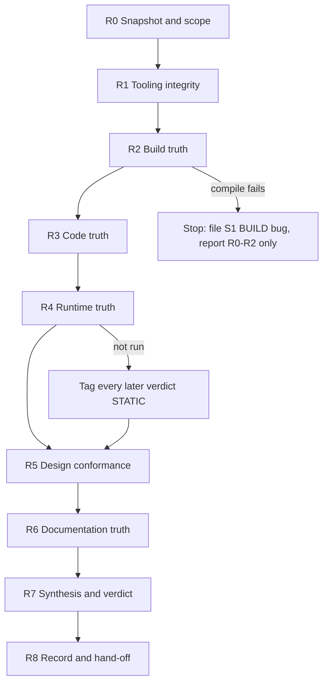

# Full Project Review Flow

> **Created**: 2026-10-08 · **Author**: PM assistant (Claude), review-only pass, no code changed
> **Companion files**: `production/review-schedule.md` (older cadence table — see §8),
> `production/qa/reviews/skill-audit-2026-10-08.md`, `production/qa/reviews/project-review-2026-10-08.md`
> (the first run of this flow).

## 1. Why this flow exists

The project already runs many review skills: a daily standup, a weekly wrap-up (code review + bug
triage), a weekly kickoff, a monthly module audit, and `/doc-sync`. Each is good at its own slice.
What none of them does is answer, end to end, **"is what we believe about this project true?"**

Four failures observed between 2026-09-22 and 2026-10-08 show the gap:

| Failure | What the existing skills did | What was missing |
|---|---|---|
| A fix was reverted the same day (`40d2c793` → `ac13ee4`, BUG-096) | The wrap-up caught it 2 days later by reading source | No runtime check; no "fix regressed?" sweep |
| `/doc-sync` (`7d1b5c79`) recorded BUG-096 as fixed while it was reverted (BUG-099) | The doc writer trusted the commit message | No step that verifies documentation claims against code |
| `CLAUDE.md` assigned BUG-093/094/095 to defects that differ from `production/qa/bugs/BUG-093..095.md` (BUG-101) | Two writers allocated IDs independently | No single ID authority |
| The last playtest file is dated 2026-06-12; every verdict since is "static analysis only" | Every report says so in a footnote | No phase that makes "unverified at runtime" a first-class verdict |

This flow orders the existing skills into one pipeline, adds the missing verification steps, and
fixes the evidence standard every output must meet. It changes no skill; §9 lists the skill changes
it recommends.

## 2. Principles

1. **Source over story.** A claim is accepted only with a `file:line` at a named HEAD, a commit hash,
   or a runtime log. Commit messages, earlier reports and `CLAUDE.md` are leads, not evidence.
2. **Every verdict carries its evidence tier.**

   | Tier | Meaning | May close a bug? |
   |---|---|---|
   | `RUNTIME` | Observed in Play Mode (log, screenshot, playtest file) | Yes |
   | `COMPILED` | Unity Editor opened at this HEAD, Console has 0 errors | Only BUILD bugs |
   | `STATIC` | Read in source only | No — may move a bug to "Fixed in code, verify pending" |
   | `CLAIMED` | Stated by a doc or commit message, not re-read | No |

3. **Review never edits code.** Findings become bug files, tech-debt entries or sprint items.
4. **One writer per fact.** Bug IDs come from `production/qa/bugs/` only (max + 1). Bug status lives in
   the bug file; `CLAUDE.md` and reports quote it. Module status lives in `systems-index.md`.
5. **Snapshots are immutable.** Dated reports are never rewritten; corrections go in a new dated file
   or an addendum.
6. **Cheap first, expensive last.** Scripted checks run before agent reads; agent reads before
   multi-agent orchestration.

## 3. Pipeline overview



| Phase | Question | Skills / tools | Output | Blocking? |
|---|---|---|---|---|
| R0 | What exactly are we reviewing? | `git` via `rtk proxy` | Review header | — |
| R1 | Can the review tooling itself be trusted? | `/skill-test audit`, §4.1 scripts | Tooling findings | No (advisory) |
| R2 | Does the project build? | Unity Editor (manual) until TD-048 lands | `COMPILED` or S1 bug | **Yes** |
| R3 | What changed, and is it sound? Are open bugs still open? | `/code-review`, `/bug-triage` re-verification | Findings table, bug status deltas | No |
| R4 | Does the critical path work when played? | `/smoke-check`, `/playtest-report` | Smoke result per item | No, but sets tier |
| R5 | Does code match design? Is design complete? | `/module-quality-audit`, `/consistency-check`, `/architecture-review`, `/content-audit` | Module scorecard | No |
| R6 | Do the docs tell the truth? | §4.6 claim sweep, `/doc-sync` *after* the sweep | Drift list | No |
| R7 | Overall state and what to do next | `/milestone-review`, `/gate-check`, `/scope-check` | Verdict + ranked actions | — |
| R8 | Is the review itself recorded? | `/sprint-plan update` | Report, bugs, changelog entry | — |

## 4. Phase detail

### R0 — Snapshot and scope

- Record: branch, HEAD (full hash), `git status` (use `rtk proxy git status` — the rtk hook can show a
  stale tree), the previous review's HEAD, and the window `prev..HEAD` (commit count, `.cs` files,
  `+/-` lines).
- List commits in the window that **no earlier review read**. Daily standups and wrap-ups each name
  the commits they covered; anything not named is "unreviewed" and goes first in R3.
- Freeze scope: if new commits land during the review, they belong to the next one.

### R1 — Tooling integrity (quarterly, or after any `.claude/` change)

Scripted, ~2 minutes. Each check is a one-liner over `.claude/`:

| Check | Pass condition |
|---|---|
| Every `subagent_type` named in a skill exists in `.claude/agents/` | 0 missing |
| Every repo path a skill reads exists, or the skill says it creates it | 0 missing *required inputs* |
| No skill assumes `src/` as the code root | Unity code root is `Assets/Script/` |
| Hooks reference live paths (e.g. `validate-commit.sh` gameplay globs) | All globs match ≥1 file |
| `docs/skill-reference.md` skill count = directories in `.claude/skills/` | Equal |
| Skill-to-skill references (`/name`) resolve | 0 dangling |
| Recurring routines fired on schedule (standup, wrap-up, kickoff, monthly audit) | No missed slot in window |

Findings go in a `skill-audit-YYYY-MM-DD.md`. A tooling defect that would make a later phase lie
(e.g. a skill reading a non-existent registry and reporting "no conflicts") must be stated in that
phase's output.

### R2 — Build truth (blocking)

- Open the project in Unity 2022.3.62f3 at HEAD; Console must show 0 compile errors. Record result as
  `COMPILED` with the date.
- Until a pre-push compile check exists (TD-048), this is manual. Two compile breaks were committed in
  four days in September (BUG-088, BUG-092).
- On failure: file one S1 BUILD bug, stop, and report R0–R2 only — nothing later can be verified.
- If the reviewer cannot open the Editor (autonomous run), record `R2: NOT RUN` and cap every later
  tier at `STATIC`.

### R3 — Code truth

1. **Diff review** of unreviewed commits from R0 with `/code-review` (or the wrap-up's surface pass).
   Every finding: `file:line`, severity S1–S4, filed / not filed.
2. **Regression sweep.** For each bug closed or "fixed in code" in the last 30 days, re-read the fix
   site at HEAD. A fix that is gone is re-opened in its own file, not silently re-described. (This
   would have caught BUG-096 on the day.)
3. **Open-bug re-verification.** Each open bug's cited `file:line` is re-read. Outcome per bug:
   unchanged / moved (new line) / fixed in code / no longer reproducible by reading.
4. **Rule conformance spot-check** against `.claude/rules/*.md` for the touched files only
   (no new singletons, interface-first DI, NonAlloc in hot paths, `[FormerlySerializedAs]` on renamed
   serialized fields, no `[SerializeField]` on runtime state).

### R4 — Runtime truth

- `/smoke-check` against a written critical-path list. Until `tests/smoke/critical-paths.md` exists
  (it does not — see skill audit), use the S17-04 list: menu → New Game → `LoadRandomMap` loads;
  first room doors behave; melee hits and kills; 4 abilities on keys 1–4; ranged weapon fires and
  hits; enemy weapon attack lands; room clear opens doors; door transition; player death → game-over
  → respawn.
- Log the session with `/playtest-report` in `production/qa/playtests/`.
- Each item is `PASS` / `FAIL` / `NOT RUN`. Not running R4 is allowed but must be **visible**: the
  report header states "R4 not run — all verdicts STATIC", and the number of days since the last
  playtest file is reported as a metric.

### R5 — Design conformance

- `/module-quality-audit` scorecard for every module in `systems-index.md` that has a GDD.
- For modules with no GDD but live code (Abilities v2, Items, UIFlow, Pathfinding, Character Core,
  Shop / Start room / Champion select), score **design coverage** only: `UNDESIGNED` + open-bug count.
- `/consistency-check` on any Approved module whose code changed in the window.
- `/architecture-review` when an ADR is `Proposed` but implemented, or was amended in the window.
- `/content-audit` when the milestone names content counts (rooms, enemies, abilities).
- Status coherence: GDD header status vs `systems-index.md` vs reality. Report every mismatch.

### R6 — Documentation truth

The step no current skill performs. Run it **before** `/doc-sync`, never after.

1. Extract every checkable claim from `CLAUDE.md`'s Known Bugs table and demo checklist, and from
   `.claude/rules/*.md` statements that name code (e.g. "`IAbilityServices` exposes five members").
2. Verify each against HEAD. Classify: `TRUE`, `STALE` (was true), `FALSE` (never true), `UNVERIFIABLE`.
3. **ID audit:** every `BUG-NNN` mentioned anywhere must match the title of
   `production/qa/bugs/BUG-NNN.md`. Any mismatch is an S3 doc bug.
4. Only then run `/doc-sync`, feeding it the `STALE`/`FALSE` list, so it corrects rather than repeats.

### R7 — Synthesis and verdict

- One overall verdict for the current milestone (demo): `ON TRACK` / `AT RISK` / `OFF TRACK`, with the
  evidence tier it rests on.
- A feature matrix: each demo-checklist item → `Done (RUNTIME)` / `Done in code (STATIC)` /
  `Partial` / `Not started`, with blocking bug IDs.
- Process metrics: planned-vs-off-plan velocity (from sprint files), carry count of the oldest Must-Have,
  days since last playtest, open S1/S2 count, `Proposed`-but-implemented ADR count, undesigned live
  systems count.
- Ranked actions (max 10), each sized and mapped to an owner role. `/gate-check` only when a phase
  transition is being asked about.

### R8 — Record and hand-off

- Write `production/qa/reviews/project-review-YYYY-MM-DD.md` (English).
- File new bugs as `production/qa/bugs/BUG-<max+1>.md`; never allocate an ID anywhere else first.
- Append an entry to `docs/CHANGELOG-DOCS.md` naming the cause (the review) and each file written.
- Hand ranked actions to `/sprint-plan update` or the next `/weekly-kickoff`.
- Chat summary follows `.claude/rules/language-reporting.md` and the owner's language preference.

## 5. Report template (R8)

```
# Project Review — YYYY-MM-DD
Snapshot: branch / HEAD / window / unreviewed commits
Evidence ceiling: R2 COMPILED|NOT RUN · R4 RUNTIME|NOT RUN
1. Verdict (one paragraph)
2. Feature matrix (demo checklist)
3. Design state (module scorecard + undesigned systems)
4. Code findings this window
5. Bug register deltas
6. Documentation drift
7. Process metrics
8. Ranked actions
9. What this review did not do
```

## 6. Severity for review findings

Same S1–S4 scale as bug files. Additional rule for doc findings: a doc error that **hides an open S1/S2**
(e.g. records it as fixed) is S3, not S4, because it removes the bug from planning.

## 7. Cadence

Mapped onto the routines that actually run (from `production/sprints/*` and commit history), not the
older Mon/Fri table:

| Cadence | Routine | Phases | Depth |
|---|---|---|---|
| Daily 10:00 | `/daily-standup` | R0, R3.1 (yesterday's commits only) | Surface |
| Weekly Sat 22:00 | `/weekly-wrapup` | R0, R3 (all), R4 attempt, R8 | Full code, triage |
| Weekly Sun 22:00 | `/weekly-kickoff` | R7 (process metrics), R8 hand-off | Planning |
| Monthly, 1st Monday | `/module-quality-audit` | R5, R6 | Design + docs |
| Quarterly / on `.claude/` change | manual | R1 | Tooling |
| Milestone / before demo | **full flow R0–R8** | All | Complete |

## 8. Relationship to existing documents

- `production/review-schedule.md` (2026-05-19) still prescribes Monday/Friday runs and the combined
  `/weekly-sprint`; the routines that actually run are the dated daily/Sat/Sun/monthly skills. Treat
  §7 above as the current cadence; the schedule file should be updated or marked superseded by the
  owner.
- `docs/skill-reference.md` remains the per-skill catalogue.

## 9. Recommended skill changes (not made — owner decision)

| # | Change | Why |
|---|---|---|
| 1 | Add a `/full-review` orchestrator skill implementing R0–R8 (inline, ≤5 agents) | No single entry point today; this flow is manual |
| 2 | Add an ID-allocation rule to `/doc-sync`, `/daily-standup`, `/weekly-wrapup`, `/bug-report`: next ID = max in `production/qa/bugs/` + 1; 3-digit format | BUG-101 collision; `/bug-report` still says `BUG-[NNNN]` |
| 3 | Add the R6 claim sweep as a mandatory first step of `/doc-sync` | BUG-099 |
| 4 | Add the R3.2 regression sweep to `/weekly-wrapup` | BUG-096 |
| 5 | Make `/smoke-check` read a project critical-path file and create it if absent | `tests/smoke/critical-paths.md` does not exist |
| 6 | Point `/consistency-check` at an existing registry or have it create one | `design/registry/entities.yaml` does not exist |
| 7 | Resolve the 13 missing agents in 6 team skills (author or rewrite) | Open since 2026-08-21 |
| 8 | Fix `validate-commit.sh` gameplay glob (`Skill_Ability/` moved to `System/`) and the session-start bug counter | Hooks report wrong data |
